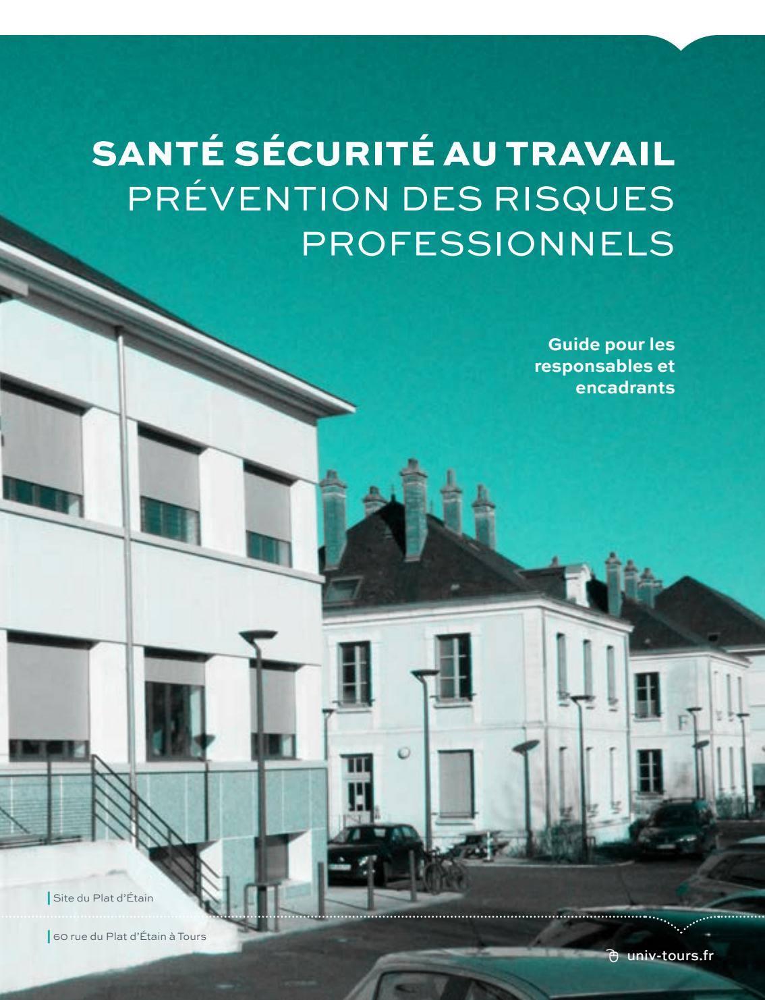

LA SÉCURITÉ EST L'AFFAIRE DE TOUS

CHACUN PEUT VOIR SA RESPONSABILITÉ ENGAGÉE

# **OBJECTIFS**DE CE GUIDE

La prévention des risques professionnels doit être une préoccupation constante pour tous, personnels, étudiants, intervenants extérieurs.

Ce guide s'adresse à tous ceux et toutes celles qui sont en situation de responsabilité et d'encadrement de personnels (directeurs de composante, responsables administratifs, directeurs d'unités de recherche, directeurs de service, chefs de service, vice-présidents, ...).

L'inflation juridique de ces dernières années accentue la pression sur les employeurs et constitue une source de risques juridiques majeurs. Il est essentiel de connaître nos responsabilités en tant qu'encadrant, non seulement pour éviter les contentieux, mais aussi pour assurer une vie professionnelle sereine à tous les personnels.

La Santé Sécurité au travail est notre responsabilité collective. Il nous faut pour cela organiser la prévention et veiller à la bonne application des règles de santé et de sécurité au travail. Vous trouverez dans ce quide :

- Des éléments qui vous aideront à remplir ces missions,
- Les interlocuteurs auxquels vous pouvez faire appel,
- Les obligations administratives et réglementaires.

Je vous demande d'apporter la plus grande attention à ces recommandations qui doivent permettre à chacun d'entre nous de travailler dans des conditions de sécurité propices à l'accomplissement de nos missions.

······································

## **SOMMAIRE**

| CE QU'IL FAUT <b>SAVOIR</b>                                                             | 6    |
|-----------------------------------------------------------------------------------------|------|
| • La réglementation générale :                                                          |      |
| • Quelles sont vos obligations ?                                                        |      |
| Concernant le financement de la sécurité                                                |      |
| LES <b>ACTEURS</b> DE LA PREVENTION                                                     | 10   |
| • Le Président                                                                          |      |
| • Les directeurs de composantes - U.F.R., Ecoles, IUT                                   |      |
| • Les enseignants, enseignants - chercheurs, BIATSS, Chercheurs,                        |      |
| <ul> <li>Les conseillers de prévention et le service de prévention (PePSS)</li> </ul>   |      |
| • Le médecin du travail                                                                 |      |
| • Le Service de Santé Universitaire (SSU)                                               |      |
| La Direction des Affaires Juridiques et du Patrimoine                                   |      |
| • La DRH - Le Bureau Formations et Concours                                             |      |
| VOS INTERLOCUTEURS                                                                      | 15   |
| <ul> <li>Au niveau de l'unité de travail</li> </ul>                                     |      |
| (composantes, laboratoires, services,)                                                  |      |
| LES <b>ACTIONS</b> A METTRE EN ŒUVRE                                                    | 16   |
| Règlement intérieur de l'unité de travail                                               |      |
| <ul> <li>Document Unique d'Evaluation des Risques (DUER)</li> </ul>                     |      |
| et autres rapports de Santé et de Sécurité au Travail                                   |      |
| Registre Santé Sécurité au Travail                                                      |      |
| <ul> <li>Obligations réglementaires liées aux activités de l'Université</li> </ul>      |      |
| <ul> <li>Documents nécessitant la signature du Président de l'université</li> </ul>     |      |
| <ul> <li>Documents nécessitant la signature des Responsables d'unité de Trav</li> </ul> | /ail |
| <ul> <li>Equipements de protection</li> </ul>                                           |      |
| • Formations                                                                            |      |
| Relations avec les entreprises extérieures                                              |      |
| ANNEXES                                                                                 | 25   |
| Coordonnées de vos interlocuteurs                                                       |      |

### CE QU'IL FAUT **SAVOIR**

#### La réglementation générale

De nombreux textes relatifs à la santé et à la sécurité des personnels et des étudiants sont applicables à notre établissement, ils concernent :

- <u>L'environnement de travail :</u> la protection des travailleurs contre l'incendie, les courants électriques, la qualité de l'air, les conditions d'application de la réglementation relative à l'amiante,...
- <u>Les activités</u>: les écrans, la détention et l'utilisation d'Agents Chimiques Dangereux (ACD dont CMR), l'utilisation d'Organismes Génétiquement Modifiés (OGM), la détention ou l'utilisation de sources ou d'équipements générateurs de Rayonnements Ionisants, les travailleurs intervenant en milieu hyperbare ou confiné, ...
- <u>Les locaux :</u> le règlement de sécurité contre l'incendie dans les Etablissement Recevant du Public (ERP), les installations techniques, ...
- <u>Les conditions de travail :</u> les Risques Psycho Sociaux, le harcèlement moral ou sexuel , ...

#### Quelles sont vos obligations?

- Nommer un Assistant de Prévention (AP) qui sera votre conseiller dans ce domaine. Lui donner le temps et les moyens nécessaires pour remplir ses missions, (lettre de cadrage : périmètre et quotité de temps dédié);
- Autoriser les personnels placés sous votre autorité à participer aux formations à la sécurité et principalement les nouveaux arrivants ;
- Etablir et faire respecter votre règlement intérieur ;
- Faire établir les consignes de sécurité de l'unité de travail, s'assurer qu'elles sont mises à jour, diffusées, affichées; s'assurer que les personnels placés sous votre responsabilité en ont connaissance et respectent leur application, en mettant en place une traçabilité (formation nouveaux arrivants, ...);
- Evaluer les risques et proposer un programme annuel de prévention (Document Unique d'Evaluation des Risques - DUER), en collaboration avec le service PrEvention Protection Santé Sécurité (PePSS);
- S'assurer que des mesures correctives sont mises en œuvre après constat de non-conformités, incidents et accidents ;
- Interdire ou modifier tous travaux de recherche, activités, manifestations dès lors que vous estimez qu'ils ne se déroulent pas dans des conditions satisfaisantes de sécurité;
- Tenir informé le Président de l'université des problèmes de sécurité que vous estimez ne pas pouvoir résoudre ;
- Connaître les procédures de droit d'alerte, de retrait et de signalement d'un danger grave et imminent ;
- Tenir compte des préconisations du Comité d'Hygiène, de Sécurité et des Conditions de Travail (C.H.S.C.T.).

Les assistants de prévention et le service PrEvention Protection Santé Sécurité (PePSS) sont à votre disposition pour vous aider à mettre en œuvre toutes ces obligations et plus généralement la politique de prévention de l'établissement.

#### Concernant le financement de la sécurité

Les besoins liés aux activités de la structure sont supportés par les crédits de la structure.

Ces besoins comprennent les équipements de protection collective (PSM II, hottes, détecteurs de gaz ou de rayonnements ionisants, ...) et individuelle (vêtement de travail, gants, masques, ...), et l'entretien des appareils (autoclaves, installations électriques liées à l'expérimentation...). Dans le cas où vous ne pouvez manifestement pas prendre en charge un impératif de sécurité, vous devez en référer au PePSS qui informera la direction de l'établissement.

- Les besoins liés à l'infrastructure des bâtiments sont pris en charge (gestion et financement) par la Direction des Affaires Juridiques et du Patrimoine (DAJP);
- Les Vérifications Techniques Règlementaires (VTR) sont prises en charge (gestion et financement) par le service PePSS;
- La collecte et le traitement des déchets sont pris en charge (gestion et financement) par le service PePSS (sans refacturation interne).

De nombreuses formations en Santé, Sécurité au Travail sont incluses dans le plan de formation de l'Université. A ce titre, elles sont prises en charge (gestion et financement) par la Direction des Ressources Humaines (DRH). Il s'agit notamment :

- De l'habilitation électrique,
- De l'habilitation à la conduite d'autoclave.
- De l'attestation de Sauveteur Secouriste du Travail (SST), de Prévention Secours Civiques niveau 1 (PSC1) et de Gestes Qui Sauvent (GQS),
- Del'Equipier de Première Intervention (EPI) : modules Chargés d'Evacuation et Maniement d'Extincteurs.
- De la formation des Assistants de Prévention et des membres du CHSCT,
- De la formation gestes et posture de travail.

Les formations liées spécifiquement à une activité par exemple les Personnes Compétentes en Radioprotection [PCR], expérimentation animale, ... peuvent faire l'objet d'une demande de stage spécifique auprès de la DRH. Si la formation est acceptée, le coût pédagogique est partagé entre l'unité de travail et la DRH.

## LES ACTEURS DE LA PRÉVENTION

#### Le Président

Le Président de l'université est responsable de la sécurité des étudiants et des personnels de l'université. Lorsque seule une délégation de signature écrite existe, elle n'opère aucun transfert de compétence. Le Président garde donc un pouvoir d'intervention et de contrôle sur les actes pris en son nom par le délégataire. Il reste responsable pénalement des actes signés par le délégataire en son nom en vertu de la délégation.

Cependant, le délégataire pourra aussi voir sa responsabilité :

- Pénale engagée s'il commet une infraction, s'il dispose d'une certaine autonomie et des moyens nécessaires pour exercer la délégation et que celle-ci est suffisamment claire et justifiée par les circonstances et ne sert pas les uniques intérêts du délégant.
- Disciplinaire être mise en cause en cas de faute commise dans l'utilisation de sa délégation de signature et plus généralement dans la gestion de son service. Cette responsabilité est indépendante de la responsabilité pénale.

Dans le cas d'une délégation de pouvoir écrite, cela entraîne un véritable transfert de compétence à une autre autorité et donc le dessaisissement du Président. Le pouvoir est transféré avec la responsabilité à un personnel. Le président n'est plus compétent pour exercer cette prérogative.

La responsabilité pénale du délégataire pourra être engagée s'il commet une infraction dans l'exercice de ses fonctions et, surtout, dans le cadre de la délégation de pouvoir.

#### Les directeurs de composantes - U.F.R., Ecoles, IUT...

En application de la délégation de signature donnée par le Président aux directeurs de composantes, ces derniers sont compétents pour signer tout acte relatif à la sécurité (les mesures utiles pour assurer le maintien de l'ordre dans les locaux de la composante, en conformité avec le règlement intérieur de l'université) et faire appel aux forces publiques exclusivement en cas de risque d'atteinte grave et imminente à l'ordre public.

# Les enseignants, enseignants - chercheurs, BIATSS, Chercheurs...

Chacun est responsable de la sécurité et de l'hygiène dans les locaux de travail. Un personnel public pourra voir sa responsabilité pénale engagée (article 121-3 du code pénal) s'il a :

- Directement commis le dommage, qui résulte d'une faute d'imprudence, de négligence ou de manquement simple à une obligation de prudence ou de sécurité prévue par la loi.
- Indirectement commis le dommage, qui résulte d'une faute qualifiée, consistant soit en une violation manifestement délibérée d'une obligation particulière de prudence ou de sécurité prévue par la loi ou le règlement, soit en une faute caractérisée exposant autrui à un risque d'une particulière gravité qu'il ne pouvait ignorer.

#### Les conseillers de prévention et le service de prévention (PePSS)

Le service Prévention Protection Santé Sécurité (PePSS) est localisé au Plat d'Étain et compte deux Conseillers de Prévention (CP) dont un est chargé des risques généraux (Incendie, Electrique, PPMS, ...) et l'autre des risques spécifiques (Chimique, Biologique, Radioactif, ...).

Les CP s'assurent du déploiement de la politique de prévention de l'établissement en collaboration avec le réseau des soixante-dix Assistants de Prévention et des treize Personnes Compétentes en Radioprotection (PCR) qui sont répartis dans les composantes, les services et les laboratoires de recherche.

Les missions du service PePSS s'articulent autour de 3 thèmes :

- La prévention des risques professionnels,
- La sécurité des biens et des personnes,
- Les filières de gestion des déchets.

Ces trois thématiques rejoignent les activités d'autres services de l'Université comme la Direction des Affaires Juridiques et du Patrimoine (DAJP) et la Direction des Ressources Humaines (DRH).

D'autres personnes participent de manière plus indirecte aux missions Sécurité au sein de l'université comme les Equipiers de Première Intervention (EPI) ou les Sauveteurs Secouristes du Travail (SST).

#### Le médecin du travail

- Le Médecin du travail est fonctionnellement rattaché au Service Prévention Protection Santé Sécurité et localisé au Plat d'Etain (Relais Santé au Travail).
- Il assure la surveillance médicale **des personnels**, arrête la périodicité des visites médicales et le contenu des examens complémentaires, en tenant compte des obligations réglementaires,
- Il répond aux demandes d'informations en matière de santé publique,
- Il définit les conduites à tenir en fonction du danger,
- Il contribue à l'évaluation des risques professionnels et à l'amélioration de l'environnement du travail (visite de locaux, étude de poste, enquête en cas de maladie professionnelle ou d'accident de travail...)
- Il participe aux réunions des Assistants de Prévention, aux séances plénières du CHSCT et à la formation du personnel (SST, etc).

#### Le Service de Santé Universitaire (SSU)

Le SSU est un Centre de Prévention et de Santé localisé au Plat d'Etain et qui dispose d'une antenne à Blois. Le SSU offre **aux étudiants** la possibilité de prendre rendez-vous avec divers professionnels de santé.

#### La Direction des Affaires Juridiques et du Patrimoine

La Direction des Affaires Juridiques et du Patrimoine est localisée au Plat d'Etain.

Sur le volet Patrimoine et Immobilier la DAJP assure notamment :

- La maintenance courante (préventive et curative) et l'adaptation courante du patrimoine immobilier,
- La conduite des opérations de construction, de mise en sécurité, de maintenance et d'adaptations lourdes,
- L'exploitation technique des bâtiments en relation avec les composantes et services de l'Université.

Le patrimoine immobilier est réparti en pôles regroupant chacun plusieurs sites. Chaque pôle est doté d'une Antenne Technique Immobilière (ATI).

Sur le volet Juridique la DAJP réalise notamment :

- L'accompagnement des composantes, directions, services et personnels pour garantir la sécurité juridique des documents et procédures (conventions, règlements, ...),
- Le suivi et le bon fonctionnement des instances centrales ou des composantes (élections, CA, ...),
- La mise en œuvre des procédures d'achats (marchés publics, ...)

#### La DRH - Le Bureau Formations et Concours

La DRH est localisée au Plat d'Etain et comprend le bureau Formations et Concours qui centralise les demandes de formation des personnels.

La liste des personnes ressource de l'ensemble de ces services se trouve en annexe.

#### VOS INTERLOCUTEURS

#### Au niveau de l'unité de travail (composantes, laboratoires, services, ...)

- ▶ L'Assistant de Prévention, pour mener à bien ses missions, doit être connu et reconnu par l'ensemble du personnel de l'unité de travail. Il devra suivre une formation spécifique règlementaire initiale de 5 jours avant sa nomination officielle et suivre une formation continue annuelle.
- ▶ Les Sauveteurs Secouristes du Travail sont des personnels volontaires, formés aux gestes de premiers secours lors d'une formation initiale de 3 jours nécessitant un recyclage bisannuel d'une journée. Dans l'établissement, ils interviennent sous la responsabilité du Président de l'Université, en cas d'accident et de malaise dans l'attente des secours.
- ▶ Les Equipiers de Première Intervention participent à l'organisation et au déroulement des exercices d'évacuation. En cas de sinistre (incendie, fuite de gaz, ...), ils assurent l'évacuation des personnels et des usagers présents.
- ▶ Les personnels spécifiquement formés à un risque ou une activité : il s'agit des détenteurs d'habilitations spécifiques (électrique, autoclave, appareils de levage et manutention, ...), des Personnes Compétentes en Radioprotection (PCR), des responsables d'expérimentation animale, les référents laser, le référent hyperbare, ...
- ▶ Les responsables de locaux et de gros appareillages sont désignés lorsque les activités particulières l'exigent telles que les confinements biologiques de niveaux 2 ou 3, les salles blanches, la manipulation de liquides cryogéniques, les ateliers, les microscopes électroniques, ...

# LES **ACTIONS** A METTRE EN ŒUVRE

**Règlement intérieur de l'unité de travail** (composantes, laboratoires de recherche, ...)

Le règlement intérieur permet de définir les règles destinées à organiser la vie de l'unité de travail, en prenant en compte l'organisation existante au sein de l'établissement. Il s'appuie sur le règlement intérieur de l'établissement. Entre autres, il précise la répartition du temps de travail (plage horaire de travail, travail isolé ...) et les règles de santé et de sécurité au travail à observer. Il doit être validé par le conseil de laboratoire ou de composante.

Contact : DAJP ou DRV

# Document Unique d'Evaluation des Risques (DUER) et autres rapports de Santé et de Sécurité au Travail

Depuis le 5 novembre 2001, la réglementation impose que l'évaluation des risques professionnels fasse l'objet de la rédaction d'un document unique intégrant le Programme d'Actions Annuel de Prévention (PAAP) de l'unité. A noter que les Risques Psychosociaux font partie intégrante des risques et doivent faire l'objet d'une évaluation dans le DUER.

La trame du DUER est disponible dans l'espace numérique du service PePSS dans l'intranet de l'Université.

Chaque service ou laboratoire doit se doter de ce document, mis à jour au moins annuellement. Cette mise à jour est effectuée de façon collégiale, animée par l'assistant de prévention, signée par le chef de service et transmis au service PePSS

En centrale, les DUERs sont archivés en vue de leur présentation lors des inspections de l'Université par l'Inspecteur en Santé Sécurité au Travail (ISST). Par ailleurs, les PAAPs sont compilés et les items mentionnés répertoriés selon les catégories des Orientations Stratégiques du Ministère (Ministère de l'Enseignement Supérieur, de la Recherche et de l'Innovation [MESRI]) dans le Programme Annuel d'Actions de Prévention de l'Université et présenté dans les instances CHSCT et CT.

Contact: Assistant de Prévention – Service Prévention
Protection Santé Sécurité (PePSS)
Document disponible sur l'espace intranet du PePSS:
† intranet.univ-tours.fr/version-francaise/vie-de-luniversite/
prevention-protection-sante-securite-pepss

#### Registre Santé Sécurité au Travail

Un Registre Santé Sécurité au Travail (RSST) doit être mis à la disposition des personnels et usagés. Il sert à transcrire tout accident / incident / observation concernant l'unité, les personnels, les usagers et visiteurs et à recueillir toute suggestion relative à la prévention des risques et à l'amélioration des conditions de travail.

L'Assistant de Prévention est chargé de sa mise en place et de sa tenue au sein du service. Une procédure d'utilisation de ces registres est disponible. La synthèse des fiches du RSST fait l'objet d'une présentation au CHSCT de l'établissement.

Contact : Assistant de Prévention – Service Prévention Protection Santé Sécurité (PePSS)

#### Obligations réglementaires liées aux activités de l'Université

Certaines activités nécessitent une déclaration ou une autorisation auprès des autorités compétentes.

#### Documents nécessitant la signature du Président de l'université

<u>Habilitations électriques</u>: les personnels identifiés comme ayant besoin d'une habilitation électrique doivent suivre une formation pour obtenir la certification « Electricien » ou « Non électricien », et être habilités par le Président de l'établissement pour exercer leurs missions.

Autorité compétente : Service Prévention Protection Santé Sécurité (PePSS)

Contact : Conseiller de Prévention (cf. annexe)

<u>Lettre de cadrage des Assistants de Prévention :</u> les Assistants de Prévention comme les Conseillers de Prévention de l'établissement doivent suivre une formation spécifique règlementaire initiale de 5 jours et continue annuelle. Ils sont nommés par le Président de l'Université.

Autorité compétente : Service Prévention Protection Santé Sécurité (PePSS)

Contact : Conseiller de Prévention (cf. annexe)

Lettre de cadrage CRP: les Personnes Compétentes en RadioProtection suivent une formation certifiante règlementaire initiale et de renouvellement selon les activités concernées. Elles sont désignées Conseillers en Radioprotection selon l'Art. R. 4451-121 du code du travail par l'employeur (article R. 4451-112 du code du Travail) et par le Responsable de l'Activité Nucléaire (RAN) (article R. 1333-18 du code de la santé publique).

Autorité compétente : Autorité de Sûreté Nucléaire (ASN)
Contact : Conseiller en Radioprotection de proximité ou central, Conseiller de
Prévention (cf. annexe)

#### Documents nécessitant la signature des Responsables d'unité de Travail (Directeurs d'Unités de recherche [DU], Responsables de Services [RS], Responsables Administratifs [RA])

<u>L'agrément pour l'utilisation des O.G.M.</u>: la manipulation d'Organismes Génétiquement Modifiés (OGM) nécessite, avant le début des expérimentations, la réalisation d'un dossier règlementaire pour obtenir un agrément correspondant. Attention à l'évolution récente (janvier 2022) de la règlementation qui demande un agrément spécifique pour les locaux.

Autorité compétente : Haut Conseil aux Biotechnologies – Commission de Génie Génétique qui sera remplacé par le Comité d'expertise des utilisations confinées d'OGM (CEUCO) en avril 2022.

Lien disponible sur l'intranet de l'Université

Contact : Référent Dossier OGM de l'unité, Conseiller de Prévention en central

<u>Dossier CODECOH</u>: préparation / Conservation d'échantillons Biologiques Humains destinés à la Recherche : La manipulation d'échantillons biologiques humains nécessite, avant le début des expérimentations, la réalisation d'un dossier règlementaire pour obtenir une autorisation adéquate.

Autorité compétente : MESRI Lien disponible sur l'intranet de l'Université DECOH de l'unité. Conseiller de prévention en

Contact : Référent Dossier CODECOH de l'unité, Conseiller de prévention en central

<u>Vérifications Techniques Réglementaires (VTR) des équipements :</u> ces contrôles portent essentiellement sur l'infrastructure des bâtiments (les installations électriques, ascenseurs, compresseurs, chaufferies, ...) et sur les équipements (extincteurs, machines-outils, sorbonnes, poste de sécurité microbiologique, appareils à pression, centrifugeuses, ...).

Ces vérifications nécessitent l'intervention de sociétés de contrôle indépendantes qui peuvent être assistées par le responsable de l'installation, l'Assistant de Prévention, en relation avec le Conseiller de Prévention.

Ils doivent faire l'objet de rapports règlementaires et peuvent être consignés dans les registres de sécurité des bâtiments.

Il vous appartient:

- De vous assurer que ces contrôles sont réalisés en temps utile par l'intermédiaire de l'affichage apposé sur les appareils et du bilan qui vous est adressé par le service PePSS.
- De procéder aux actions nécessaires à la levée des non-conformités identifiées dans les rapports transmis.

Réalisation et affichage de consignes de sécurité : la mise en place de consignes de sécurité a pour but d'informer de la présence d'un risque ainsi que des mesures de sécurité à mettre en place pour éviter tout accident. Elles doivent être claires et précises.

Les consignes de sécurité générales à l'Université sont rédigées et transmises par le service PePSS. Ces fiches Consignes UT sont disponibles sur le site intranet de l'Université.

Celles-ci doivent être affichées dans **tous les locaux** de l'établissement sans distinction.

Les consignes de sécurité internes aux structures doivent être rédigées par les acteurs compétents du laboratoire, en collaboration avec l'Assistant de Prévention.

A titre d'exemple, on peut citer les procédures suivantes :

- Pesée des produits Cancérigènes, Mutagènes et toxiques pour la Reproduction (CMR),
- Suivi des accidents exposant aux liquides biologiques d'origine humaine,
- · Accident radiologique,
- Déversement de produits chimiques,
- Etc. ...

Organisation des premiers secours sur les sites : les premiers secours doivent être organisés de façon à assurer l'intervention la plus rapide possible. L'organisation des premiers secours au sein du service doit se faire en concertation avec l'Assistant de Prévention, les Sauveteurs Secouristes du Travail et les Equipiers de Première Intervention dans le respect des Consignes de l'Université. Ces acteurs doivent être formés avec parfois l'obligation d'une actualisation régulière des compétences, principalement les Sauveteurs Secouristes du Travail.

Il convient de s'assurer d'une présence permanente d'un nombre suffisant de ces acteurs et leurs répartitions dans les locaux même en situation dégradée (télétravail, congés, ...).

Accident et Incident : chaque accident de travail, de service, de trajet ou survenu en mission doit faire l'objet d'une déclaration qui permet sa reconnaissance et la prise en charge de ses conséquences par l'employeur. Les différents types d'imprimés nécessaires à l'établissement des déclarations d'accident sont disponibles au secrétariat de la composante ou auprès de la DRH (intranet).

D'autre part, afin d'éviter que les accidents et incidents ne se reproduisent, il est important d'en analyser les causes et de mettre en œuvre des actions correctives. Pour cela, il est nécessaire de prévenir le service PePSS immédiatement en cas d'urgence ou via une fiche du Registre de Santé Sécurité au Travail (RSST). Un récapitulatif de ces fiches est régulièrement présenté au CHSCT de l'établissement.

<u>Surveillance médicale</u>: l'établissement a une obligation règlementaire de proposer à ses personnels une visite médicale à fréquence déterminée par l'exposition ou non à des risques particuliers (suivi individuel renforcé [SIR]); les personnels ont l'obligation règlementaire de se présenter à ces visites médicales.

Il vous appartient de vous assurer que le personnel de votre service ou laboratoire répond aux convocations obligatoires du service de médecine de prévention.

Le médecin du travail doit être informé des départs (Retraites, mouvements, congés maternité ou maladie) et des arrivées (nouveaux arrivants, retour de congés maternité, de congés maladie, ...). Il doit être destinataire de la liste des personnes exposées à des risques particuliers (biologiques, chimiques, rayonnements ionisants, etc.), et d'une copie des fiches individuelles d'exposition (agents chimiques dangereux [CMR], rayonnements ionisants). Lors du départ du personnel vous devez lui fournir une attestation d'exposition antérieure dont le médecin remplira ensuite le volet médical.

A sa demande, un personnel peut bénéficier à tout moment d'une visite auprès du médecin du travail.

#### Equipements de protection

<u>Collective</u>: pour chaque risque, il est essentiel de privilégier les équipements de protection collective.

Veiller à ce que les équipements soient adaptés aux risques et vous assurer qu'ils sont régulièrement entretenus et contrôlés par des organismes agréés.

A titre d'exemples, ce sont : les Postes de Sécurité Microbiologique (PSM), les douches de sécurité, le matériel de détection, les extincteurs, les DAE (Défibrillateur Automatisé Externe) ...

Individuelle: mettre à la disposition du personnel des équipements de protection individuelle adaptés aux activités (gants, blouses, masques, lunettes, chaussures ...). A titre d'exemple, la nature des gants varie selon les produits manipulés (biologiques, chimiques organiques ou minéraux, animaux ...), les lunettes sont fonction du risque considéré et sont différentes selon qu'elles offrent une protection contre des projections (chimiques, biologiques) ou des rayonnements (ionisants, UV, laser, ...)

Il est indispensable d'associer le personnel concerné au choix de ces équipements.

Une attention particulière doit être portée sur leurs conditions de stockage et d'entretien ainsi qu'à leur vérification.

Contact : Assistant de Prévention – Service Prévention Protection Santé Sécurité

#### Formations

Elles sont fonction du type de personnel ciblé (nouveaux entrants par exemple) ou de l'activité. Selon le cas, elles sont dispensées par :

- L'Assistant de Prévention et le personnel encadrant de l'unité, notamment au moment de la prise de fonction, pour informer des procédures d'évacuation et des consignes, des risques particuliers dans l'unité de travail et au poste de travail,
- Des organismes de formation agréés: il s'agit de formations spécifiques comme celles de Personnes Compétentes en Radioprotection, manipulation du matériel de levage, conduite d'autoclave...
- Des prestataires de service pour des stages tels que gestes et postures, travail sur écran
- Des personnels de l'université ayant les certifications requises pour être formateur (4 formateurs Sauveteurs Secourisme du Travail à l'Université de Tours).

Le retour d'expérience sur ces formations est suivi par le service Formation de l'Université qui communique avec le service PePSS afin d'assurer une qualité optimale de ces formations.

#### Relations avec les entreprises extérieures

Toute intervention d'entreprise extérieure au sein d'un laboratoire ou d'un service doit faire l'objet de procédures particulières :

- Visite du lieu d'intervention avec l'entreprise pour analyser les risques sur la période d'intervention et déterminer les moyens de prévention adaptés, pour le laboratoire et l'entreprise extérieure,
- Attestation de visite ou Plan de Prévention selon la durée de l'opération (Plan de Prévention si intervention > 400 heures) ou la nature des risques (dès lors qu'il y a risque particulier [chimique, biologique, radiologique, etc.]),
- Permis de feu en cas de travail par point chaud (soudure, meulage, etc. ...).

Les documents cités ainsi que des informations complémentaires concernant la mise en œuvre de ces procédures sont disponibles auprès du service PePSS et sur le site intranet de l'Université :

† intranet.univ-tours.fr/vie-de-l-universite/PrEventionProtection Santé Sécurité(PEPSS)/Gestion des risques professionnels à l'Université.

#### **ANNEXES**

#### Coordonnées de vos interlocuteurs

#### Service Prévention Protection Santé Sécurité (PePSS)

Les Conseillers de Prévention :

Jérôme DELANOUE | 图 02-47-36-73-15

⊠ jerome.delanoue@univ-tours.fr

Caroline JACQUES | 图 02-47-36-64-05

□ caroline.jacques@univ-tours.fr

the intranet.univ-tours.fr/version-francaise/vie-de-luniversite/prevention-protection-sante-securite-pepss

#### Médecine du travail : Pôle Relais Santé au Travail

Secrétariat :

Charlène BOIS | 图 02-47-36-80-10

☑ charlene.bois@univ-tours.fr

Médecin du Travail:

Marie Amelie MENARD | 图 02-47-36-79-39

⋈ marie-amelie.menard@univ-tours.fr

Psychologue du Travail:

Carole DELAVENAY | @ 02-47-36-77-11 | 06-16-91-86-24

⊠ carole.delavenay@univ-tours.fr

#### La Direction des Affaires Juridiques et du Patrimoine

Jérôme BARRERE | 图 02-47-36-80-98

⊠ jerome.barrere@univ-tours.fr

⊠ daj@univ-tours.fr

#### Service Technique de l'Immobilier

Walter SAULQUIN | ® 02-47-36-78-86

 $\boxtimes$  walter.saulquin@univ-tours.fr

niv-tours.fr

#### Direction des Ressources Humaines (DRH)

Anne KHOURY | @ 02-47-36-80-68 

☑ anne.khoury@univ-tours.fr

# Service du recrutement de la formation et de la gestion des compétences

Dominique AUBRY | @ 02-47-36-81-15

☑ dominique.aubry@univ-tours.fr

#### Coordinatrice Pôle Formation, concours

Ingrid JOUBERT | @ 02-47-36-81-40

☑ ingrid.joubert@univ-tours.fr

#### Le Comité d'Hygiène de Sécurité et des Conditions de Travail (CHSCT)

Secrétariat:

Lydia SEABRA-KERMOAL | @ 02-47-36-14-87

☑ seabra@univ-tours.fr

#### Les antennes techniques immobilières

| Antenne Technique Immobilière | Affectation des sites                                                                                                                                                        | Interlocuteur                          |
|-------------------------------------|------------------------------------------------------------------------------------------------------------------------------------------------------------------------------|----------------------------------------|
| BLOIS                               | Médiathèque IUT de Blois Antenne de l'UFR Droit, Economie et Sciences Sociales Antenne de l'UFR Sciences et techniques                                           | Maxime RICQUE 02-54-55-81-07        |
| GRANDMONT                           | UFR des Sciences et Techniques UFR des Sciences Pharmaceutiques Jardin des Plantes Chinon                                                                           | Walter SAULQUIN 02-47-36-73-04      |
| LUTHIER                             | IUT de Tours IUT GEII (Grandmont)                                                                                                                                         | Stéphane GUY 06-14-42-36-65         |
| PORTALIS PLAT d'ETAIN            | Présidence, Services centraux et communs UFR de Droit, Economie et Sciences So- ciales EPU MSH CEROC CERMEL                                                | Christophe PLOUSEY 02-47-36-66-11   |
| TANNEURS                            | UFR Lettres et langues UFR Arts et Sciences Humaines BU Arts et Sciences Humaines et Lettres et Langues Service Culturel, Salle Thélème CUEFFE CFMI CESR FROMONT Musicologie | Jean Philippe GOUBIN 02-47-36-64-26 |
| TONNELLE                            | UFR de Médecine Unité INSERM 1100 (bâtiment 47C) CERRP                                                                                                                 | Stéphane GUEGAN 02-47-36-60-07      |

#### SANTÉ SÉCURITÉ AU TRAVAIL PRÉVENTION DES RISQUES PROFESSIONNELS

Guide pratique à destination de tous les personnels en situation de responsabilité et d'encadrement: L'équipe de gouvernance, Directeurs de composante, responsables administratifs, directeurs d'unités de recherche, directeurs de service, chefs de service...

# Université de Tours 60 rue du Plat d'Étain 37020 Tours Cedex 1 02 47 36 66 00 huniv-tours.fr

