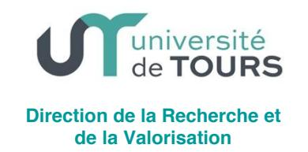
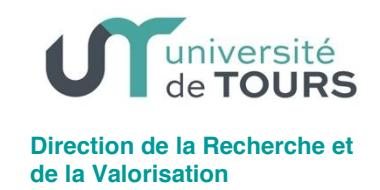

#### **EXERCICE 2019**

# CONSEIL D'ADMINISTRATION DE L'UNIVERSITÉ DE TOURS Séance du 3 juin 2019

### **DÉLIBÉRATION nº2019-33**

Le conseil d'administration s'est réuni le 3 juin 2019 en séance plénière, sur convocation du Président de l'université, adressée le vendredi 24 mai 2019.

#### Point de l'ordre du jour :

6.1. Cadrage des mobilités recherche des enseignants-chercheurs

Vu le code de l'éducation, Vu les statuts de l'université de Tours, Vu l'avis de la commission de la recherche du 19 mars 2019,

#### Exposé de la décision :

En l'absence de disposition régissant l'affectation et le changement d'affectation des enseignantschercheurs dans les unités de recherche de l'université, il est proposé d'approuver un cadrage de la mobilité recherche au sein des unités de l'université.

#### Proposition de décision soumise au conseil :

- approbation du cadrage des mobilités recherche des enseignants-chercheurs :
  - . changement d'affectation recherche au sein de l'université de Tours (p.j.)
- . affectation recherche (accueil) d'un enseignant-chercheur extérieur dans une unité de l'université de Tours (p.j.)
- . affectation recherche (sortante) d'un enseignant-chercheur de l'université de Tours dans une unité de recherche externe à l'université de Tours (p.j.)

### Après en avoir délibéré, le conseil d'administration approuve la présente décision, comme suit :

| 37 | Nombre de membres constituant le conseil :        |
|----|---------------------------------------------------|
| 19 | Quorum :                                          |
| 29 | Nombre de membres participant à la délibération : |
| 0  | Abstentions :                                     |
| 29 | Votes exprimés :                                  |
| 29 | Pour :                                            |
| 0  | Contre :                                          |

### Pièces jointes :

- cadrage de la mobilité recherche des enseignants-chercheurs.

Fait à Tours, le 04/06/2019 Le Président

Philippe Vendrix

Classée au registre des délibérations du conseil d'administration, consultable au secrétariat de la direction des affaires juridiques Délibération publiée sur le site internet de

12 JUN 2019

l'université le :

Transmise au recteur le :

1 2 JUIN 2019

### CADRAGE MOBILITE RECHERCHE D'UN ENSEIGNANT-CHERCHEUR

# CHANGEMENT D'AFFECTATION RECHERCHE AU SEIN DE L'UNIVERSITE DE TOURS (UT)

L'université souhaite fixer le cadre général de mobilité recherche des enseignants-chercheurs au sein de l'UT

### Textes de référence

Décret n° 84-431 du 6 juin 1984 modifié fixant les dispositions statutaires communes applicables aux enseignants chercheurs et portant statut particulier du corps des professeurs des universités et du corps des maîtres de conférences. Code de l'éducation et notamment l'article 713-1 Arrêté du 25 Mai 2016 relatif à la formation doctorale Statuts de l'Université de Tours

# Cadrage:

Un enseignant-chercheur de l'UT peut demander son changement d'affectation recherche, idéalement lors d'un nouveau contrat quinquennal, ou en cours de contrat quinquennal. La demande est individuelle et motivée. Lorsqu'il s'agit de la mobilité d'une équipe, il y aura autant de demandes que de personnes, mais regroupées en un dossier unique.

Le changement de structure de recherche sera sans conséquence sur la dotation financière de l'année en cours accordée par l'UT à l'unité de recherche.

La date d'effet souhaitée sera clairement indiquée dans le dossier de demande.

## Procédure :

Le dossier de demande complet, à l'attention de Monsieur le Vice-Président en charge de la Recherche de l'Université de Tours, est à transmettre à la DRV-RED pour son instruction. A réception, la date de passage en CAC sera transmise à l'intéressé

La demande sera soumise pour avis à la commission recherche restreinte (avis consultatif) puis au conseil académique siégeant en formation restreinte aux enseignants-chercheurs.

Suite à cet avis, le Président prendra la décision d'autorisation ou de refus de mobilité

En cas de refus, l'intéressé pourra demander le réexamen de sa demande auprès du conseil d'administration siégeant en formation restreinte aux enseignants-chercheurs.

La décision de changement d'affectation recherche sera transmise à la DRH, à la DRV et à la DAF qui procèderont au traitement des

dossiers relevant de leur compétence et à la mise à jour de leurs systèmes d'information.

Le dossier de demande comprendra les pièces et devra répondre aux exigences suivantes :

- 1. La demande motivée de changement d'unité et la date d'effet souhaitée
- 2. Le projet de recherche
- 3. L'avis du directeur de l'unité de départ
- 4. L'accord du directeur de l'unité d'arrivée, après avis du conseil de laboratoire ou de l'instance qui en tient lieu
- 5. La liste des doctorants, leur école doctorale, année et établissement d'inscription, leur financement. Le devenir de chaque doctorant devra être précisé et validé par l'intéressé et les directeurs des unités et des écoles doctorales de départ et d'accueil
- 6. La liste des ressources financières. Leur devenir devra faire l'objet d'un accord entre les deux unités et de démarches auprès des financeurs par les services compétents (DRV (AFRV), DAF, Agence comptable)
- 7. La liste des engagements juridiques impliquant l'enseignant-chercheur et/ou les doctorants concernés. Leur transfert ou leur résiliation sera traité par les services compétents (DRV (SPIV et/ou RED))
- 8. Le matériel expérimental et les données acquises au sein de l'unité avant la mobilité sont propriétés de l'établissement et ne changent pas d'affectation. Toutefois, ils pourront faire l'objet d'un accord entre les directeurs de laboratoire de départ et d'arrivée.
- 9. Le cahier de laboratoire devra être remis au directeur de l'unité de départ, selon la réglementation en vigueur

# CADRAGE MOBILITE RECHERCHE D'UN ENSEIGNANT-CHERCHEUR

# ACCUEIL RECHERCHE D'UN ENSEIGNANT-CHERCHEUR EXTERIEUR A L'UNIVERSITE DE TOURS (UT) VERS UNE UNITE DE L'UT (ENTRANT)

L'université de Tours souhaite fixer le cadre général d'accueil en mobilité recherche des enseignants-chercheurs extérieurs à l'UT.

# Textes de référence

Décret n° 84-431 du 6 juin 1984 modifié fixant les dispositions statutaires communes applicables aux enseignants chercheurs et portant statut particulier du corps des professeurs des universités et du corps des maîtres de conférences.

Code de l'éducation et notamment l'article 713-1 Arrêté du 25 Mai 2016 relatif à la formation doctorale Statuts de l'Université de Tours

# Cadrage:

Ce cadrage concerne les Professeurs des Universités et Maîtres de Conférences en fonction dans une autre université ou école sous tutelle exclusive ou partagée du MESR. Un enseignant-chercheur extérieur à l'université de Tours peut demander son changement d'affectation recherche, idéalement lors d'un nouveau contrat quinquennal, ou en cours de contrat quinquennal.

La demande doit être individuelle et motivée. Lorsqu'il s'agit de la mobilité d'une équipe, il y aura autant de demandes que de personnes, mais regroupées en un dossier unique.

L'affectation à la structure de recherche sera sans conséquence sur la dotation financière de l'année en cours accordée par l'UT à la structure.

La date d'effet souhaitée sera clairement indiquée dans le dossier de demande.

Cette affectation recherche fera l'objet d'une convention limitée à la durée du contrat quinquennal, renouvelable, entre l'établissement employeur et l'UT en respectant de nouveau la procédure décrite ci-après.

Cette affectation ne pourra prendre effet qu'à l'issue de la signature de cette convention dont les modalités conventionnelles sont rappelées ci-après :

Une convention d'accueil déterminera les modalités contractuelles de cette mobilité et précisera la date d'effet de cette mobilité. Elle sera mise en œuvre par l'établissement hébergeur des locaux où le projet de recherche sera réalisé.

Hors dispositions particulières, cette convention sera signée par les tutelles de l'unité de

recherche.

L'UT ne demandera pas de contrepartie financière à cet accueil.

L'établissement d'origine devra s'engager à céder sans contrepartie la propriété intellectuelle qu'il détiendra sur les résultats de l'enseignant-chercheur développés pendant l'accueil.

### Procédure :

Le dossier de demande complet, à l'attention de Monsieur le Vice-Président en charge de la Recherche de l'Université de Tours, est à transmettre à la DRV-RED pour son instruction. A réception, la date de passage en CAC sera transmise à l'intéressé.

La demande sera soumise pour avis à la commission recherche restreinte (avis consultatif) puis au conseil académique siégeant en formation restreinte aux enseignants-chercheurs.

Suite à l'avis du CAC, le Président prendra la décision d'autorisation ou de refus de l'accueil.

La DRV-SPIV rédigera et fera signer la convention d'accueil par les établissements concernés et la transmettra aux services concernés pour attribution : DRH, DRV, DAF.

Le dossier comprendra les pièces et devra répondre aux exigences suivantes :

- 1. La demande motivée d'accueil dans l'unité et la date d'effet souhaitée
- 2. Le projet de recherche
- 3. L'accord du directeur de l'unité de départ
- 4. L'avis de l'université de départ
- 5. L'accord du directeur de l'unité d'arrivée, après avis du conseil de laboratoire ou de l'instance qui en tient lieu
- 6. La liste des doctorants sous la direction du chercheur concerné par la mobilité, leur école doctorale, année et établissement d'inscription et leur financement. Le devenir de chaque doctorant devra être précisé et validé par l'intéressé et les directeurs des unités et des écoles doctorales de départ et d'accueil
- Le cas échéant, la liste des ressources financières à transférer à l'UT, après accord entre les deux unités. Les démarches auprès des financeurs seront réalisées par les services compétents des établissements (DRV (AFRV), DAF, Agence comptable pour l'UT)
- 8. Le matériel expérimental et des données acquises avant la mobilité sont propriétés de l'établissement d'origine et ne changent pas d'affectation. Toutefois, ils pourront faire l'objet d'un accord des directeurs de laboratoire de départ et d'arrivée sur leur transfert.
- 9. Le cahier de laboratoire devra être remis au directeur de l'unité de départ, selon la réglementation en vigueur

# Direction de la Recherche et de la Valorisation

# CADRAGE MOBILITE RECHERCHE D'UN ENSEIGNANT-CHERCHEUR

# ACCUEIL RECHERCHE D'UN ENSEIGNANT-CHERCHEUR DE L'UNIVERSITE DE TOURS (UT) VERS UNE UNITE HORS UT (SORTANT)

L'université souhaite fixer le cadre général de mobilité recherche sortante des enseignants-chercheurs de l'UT.

### Textes de référence

Décret n° 84-431 du 6 juin 1984 modifié fixant les dispositions statutaires communes applicables aux enseignants chercheurs et portant statut particulier du corps des professeurs des universités et du corps des maîtres de conférences. Code de l'éducation et notamment l'article 713-1 Arrêté du 25 Mai 2016 relatif à la formation doctorale Statuts de l'Université de Tours

# Cadrage:

Ce cadrage concerne les Professeurs des Universités et Maîtres de Conférences en fonction à l'Université de Tours. Un enseignant-chercheur de l'UT peut demander son changement d'affectation recherche, idéalement lors d'un nouveau contrat quinquennal, ou en cours de contrat quinquennal.

La demande doit être individuelle et motivée. Lorsqu'il s'agit de la mobilité d'une équipe, il y aura autant de demandes que de personnes, mais regroupées en un dossier unique.

Le changement de structure de recherche sera sans conséquence sur la dotation financière pour l'année en cours de l'unité de départ accordée par l'UT.

La date d'effet souhaitée sera clairement indiquée dans le dossier de demande.

Cette affectation recherche fera l'objet d'une convention limitée à la durée du contrat quinquennal, renouvelable, entre l'établissement employeur et l'UT en respectant de nouveau la procédure décrite ci-après.

Cette affectation ne pourra prendre effet qu'à l'issue de la signature de cette convention dont les modalités conventionnelles sont rappelées ci-après :

Une convention d'accueil déterminera les modalités contractuelles de cette mobilité et précisera la date d'effet de cette mobilité.

:

Elle sera mise en œuvre par l'établissement hébergeur des locaux où le projet de recherche sera réalisé

Hors dispositions particulières, cette convention sera signée par les tutelles de l'unité de recherche.

L'UT ne versera pas de contrepartie financière à cet accueil.

L'UT s'engagera à céder sans contrepartie la propriété intellectuelle qu'il détiendra sur les résultats de l'enseignant-chercheur développés pendant l'accueil.

### Procédure:

Le dossier de demande complet, à l'attention de Monsieur le Vice-Président en charge de la Recherche de l'Université de Tours, est à transmettre à la DRV-RED pour son instruction. A réception, la date de passage en CAC sera transmise à l'intéressé.

La demande sera soumise pour avis à la commission recherche restreinte (avis consultatif) puis au conseil académique siégeant en formation restreinte aux enseignants-chercheurs.

Suite à l'avis du CAC, le Président prendra la décision d'autorisation ou de refus de mobilité

En cas de refus, l'intéressé pourra demander le réexamen de sa demande auprès du conseil d'administration siégeant en formation restreinte aux enseignants-chercheurs.

La décision de changement d'affectation recherche sera transmise à la DRV-SPIV pour rédaction et signature de la convention. Le SPIV rédigera et fera signer la convention d'accueil par les établissements concernés et la transmettra aux services concernés pour attribution : DRH, DRV, DAF.

Le dossier comprendra les pièces et devra répondre aux exigences suivantes :

- 1. La demande motivée d'accueil dans l'unité et la date d'effet souhaitée
- 2. Le projet de recherche
- 3. L'avis du directeur de l'unité de départ
- 4. L'accord du directeur de l'unité d'arrivée, après avis du conseil de laboratoire ou de l'instance qui en tient lieu
- 5. L'accord de l'université d'arrivée
- 6. La liste des doctorants sous la direction du chercheur concerné par la mobilité,, leur école doctorale, année et établissement d'inscription, leur financement. Le devenir de chaque doctorant devra être précisé et validé par l'intéressé et les directeurs des unités et des écoles doctorales de départ et d'accueil
- 7. Le cas échéant, la liste des ressources financières à transférer à l'université d'accueil après accord entre les 2 unités. Leur devenir devra faire l'objet d'un accord entre les deux unités et de démarches auprès des financeurs par les services compétents des deux établissements (DRV-AFRV, DAF, Agence comptable pour l'UT)
- 8. La liste des engagements juridiques impliquant l'enseignant-chercheur et/ou les doctorants concernés. Leur transfert ou leur résiliation sera traité par les services compétents (DRV-SPIV)
- 9. Le matériel expérimental et des données acquises avant la mobilité sont propriétés de l'établissement d'origine et ne changent pas d'affectation. Toutefois, ils pourront faire l'objet d'un accord des directeurs de laboratoire de départ et d'arrivée sur leur transfert.
- 10. Le cahier de laboratoire devra être remis au directeur de l'unité de départ, selon la réglementation en vigueur