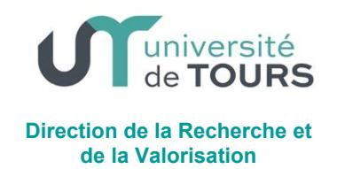

#### CADRAGE MOBILITE RECHERCHE D'UN ENSEIGNANT-CHERCHEUR

# CHANGEMENT D'AFFECTATION RECHERCHE AU SEIN DE L'UNIVERSITE DE TOURS (UT)

L'université souhaite fixer le cadre général de mobilité recherche des enseignants-chercheurs au sein de l'UT

#### Textes de référence

Décret n° 84-431 du 6 juin 1984 modifié fixant les dispositions statutaires communes applicables aux enseignants chercheurs et portant statut particulier du corps des professeurs des universités et du corps des maîtres de conférences. Code de l'éducation et notamment l'article 713-1 Arrêté du 25 Mai 2016 relatif à la formation doctorale Statuts de l'Université de Tours

## Cadrage:

Un enseignant-chercheur de l'UT peut demander son changement d'affectation recherche, idéalement lors d'un nouveau contrat quinquennal, ou en cours de contrat quinquennal. La demande est individuelle et motivée. Lorsqu'il s'agit de la mobilité d'une équipe, il y aura autant de demandes que de personnes, mais regroupées en un dossier unique.

Le changement de structure de recherche sera sans conséquence sur la dotation financière de l'année en cours accordée par l'UT à l'unité de recherche.

La date d'effet souhaitée sera clairement indiquée dans le dossier de demande.

### Procédure :

Le dossier de demande complet, à l'attention de Monsieur le Vice-Président en charge de la Recherche de l'Université de Tours, est à transmettre à la DRV-RED pour son instruction. A réception, la date de passage en CAC sera transmise à l'intéressé.

La demande sera soumise pour avis à la commission recherche restreinte (avis consultatif) puis au conseil académique siégeant en formation restreinte aux enseignants-chercheurs.

Suite à cet avis, le Président prendra la décision d'autorisation ou de refus de mobilité

En cas de refus, l'intéressé pourra demander le réexamen de sa demande auprès du conseil d'administration siégeant en formation restreinte aux enseignants-chercheurs.

La décision de changement d'affectation recherche sera transmise à la DRH, à la DRV et à la DAF qui procèderont au traitement des

dossiers relevant de leur compétence et à la mise à jour de leurs systèmes d'information.

Le dossier de demande comprendra les pièces et devra répondre aux exigences suivantes :

- 1. La demande motivée de changement d'unité et la date d'effet souhaitée
- 2. Le projet de recherche
- 3. L'avis du directeur de l'unité de départ
- 4. L'accord du directeur de l'unité d'arrivée, après avis du conseil de laboratoire ou de l'instance qui en tient lieu
- 5. La liste des doctorants, leur école doctorale, année et établissement d'inscription, leur financement. Le devenir de chaque doctorant devra être précisé et validé par l'intéressé et les directeurs des unités et des écoles doctorales de départ et d'accueil
- 6. La liste des ressources financières. Leur devenir devra faire l'objet d'un accord entre les deux unités et de démarches auprès des financeurs par les services compétents (DRV (AFRV), DAF, Agence comptable)
- 7. La liste des engagements juridiques impliquant l'enseignant-chercheur et/ou les doctorants concernés. Leur transfert ou leur résiliation sera traité par les services compétents (DRV (SPIV et/ou RED))
- 8. Le matériel expérimental et les données acquises au sein de l'unité avant la mobilité sont propriétés de l'établissement et ne changent pas d'affectation. Toutefois, ils pourront faire l'objet d'un accord entre les directeurs de laboratoire de départ et d'arrivée.
- 9. Le cahier de laboratoire devra être remis au directeur de l'unité de départ, selon la réglementation en vigueur