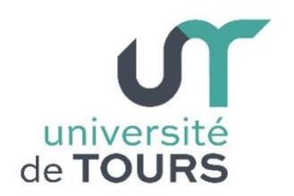

## LETTRE D'INVITATION

TOURS, le Date

Objet : Objet du séjour de recherche

Cher/Chère Nom du demandeur.

## UNIVERSITÉ DE TOURS

60 rue du Plat d'Étain-BP 12050 37020 Tours Cedex 1

univ-tours.fr

En tant que Directeur du Laboratoire Nom de l'Unité de Recherche , j'ai le plaisir de vous confirmer que notre structure accepte de vous accueillir pour une période de recherche Durée à l'université de Tours, du Date début à Date de fin sous la responsabilité de M./Mme, Nom et statut de l'hôte.

Conformément à nos échanges précédents, votre séjour s'orientera sur une thématique de recherches sur le sujet de Sujet du séjour de recherche. Ce champ de recherche, pour lequel votre contribution sera très appréciée par notre équipe, est tout-à-fait cohérent avec nos axes de rechercher ainsi que ceux que l'université de Tours souhaite promouvoir et développer.

| L'accueil a | au sein de | e la structure s'effectuera | aux horaires | et lieux suivants |
|-------------|------------|-----------------------------|--------------|-------------------|
|             | Date(s)    | Horaires                    | Lieu         |                   |
|             |            |                             |              |                   |

Il est entendu que votre séjour sera financé par Nature du financement. Cette invitation ne peut, en aucun cas, se substituer à un contrat de travail, une convention pour séjour recherche ou toute formalité officielle nécessaire relative à votre situation à l'Université de Tours. Pour instruire votre demande de séjour recherche à l'Université de Tours vous devrez prendre attache avec la Direction de la Recherche et de la Valorisation et la Direction des Relations Internationales en communiquant la présente lettre à l'adresse email sejour.recherche@univ-tours.fr.

Dans l'attente de vous rencontrer, veuillez recevoir, Madame/Monsieur Nom du demandeur mes salutations respectueuses.

| Nom du référent scientifique      | Nom du directeur d'unité          |
|-----------------------------------|-----------------------------------|
| Fonction du référent scientifique | Directeur de l'unité de recherche |
| Signature                         | Signature                         |