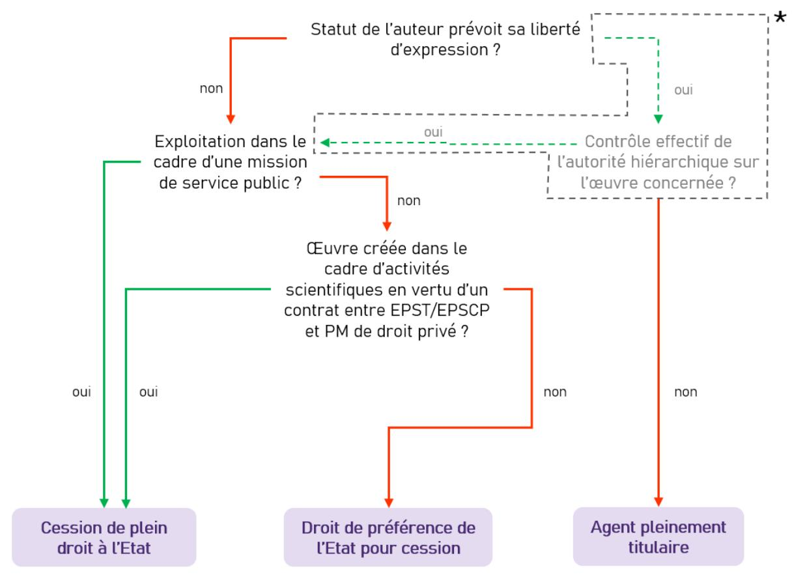

# Œuvres créées par des agents publics

Naissance, Exercice, Cession, Moyens de preuve

#### Remarques préliminaires:

- Cette fiche est issue de la refonte, de la mise à jour et de la réécriture de plusieurs fiches plus anciennes :
  - Fiche « Les Exceptions au droit d'auteur » (2010)
  - Fiche « Les moyens de preuve en droit d'auteur » (2010)
  - o Fiche « Droit d'auteur des agents publics » (2012)
  - o Fiche « La cession en droit d'auteur » (2013)
- Cette fiche s'intéresse au régime applicable aux œuvres créées postérieurement à 2006: pour les œuvres créées antérieurement, un autre régime est applicable. En effet, antérieurement à l'entrée en vigueur de la loi du 1er août 2006 relative au droit d'auteur et aux droits voisins dans la société de l'information, un agent public auteur d'une œuvre jouissait de droits de propriété intellectuelle sur l'œuvre dont la création était détachable du service; qu'il en était ainsi, notamment, si cette œuvre avait été faite en dehors du service et de toute commande du service ou si elle était sans rapport direct avec les fonctions exercées par l'auteur au sein du service.
- Cette fiche n'a pas non plus vocation à décrire le régime applicable aux logiciels, qui font l'objet d'un régime à part.

#### Introduction:

L'agent public peut, dans l'exercice de ses fonctions, créer ou participer à la création d'une « œuvre de l'esprit », au sens du Code de la propriété intellectuelle. De par sa simple naissance, cette œuvre de l'esprit bénéficie d'une protection qui se manifeste par une exclusivité donnée à l'auteur de certaines prérogatives.

Si son statut d'agent public n'emporte pas dérogation au bénéfice du droit d'auteur, la loi prévoit néanmoins quelques aménagements à l'exercice des prérogatives attachées à ce droit dans l'hypothèse d'une œuvre créée par un agent public dans l'exercice de ses fonctions ou d'après les instructions reçues.

Nous vous proposons d'étudier dans cette fiche les bases du régime légal de protection des œuvres, ainsi que les modalités de son exercice. Enfin, une liste rapide de différents modes de preuve est présentée.

Nous avons essayé d'illustrer au maximum les dispositions légales par des jurisprudences relatives au monde de la recherche.

Cette « note du réseau C.U.R.I.E. » ne prétend pas à l'exhaustivité et ne peut engager la responsabilité de ses auteurs. Elle n'est qu'un reflet des textes applicables à ce jour et de leur interprétation et une synthèse des expériences des auteurs. Elle peut être amenée à évoluer, à être enrichie, modifiée.

**Date**: Mai 2025

#### Co-auteurs

#### **AUTRICE DE LA FICHE REVUE:**

• Salomé PETROFF, Université Paris-Saclay

#### **AUTEURS DES ANCIENNES FICHES:**

- Mireille ROUZAUD, Université Paris 8 Vincennes-Saint-Denis (fiche « Les moyens de preuve en droit d'auteur » et « La cession en droit d'auteur », fiche « Les Exceptions au droit d'auteur »)
- Patricia HEC (fiche « Droit d'auteur des agents publics »)
- Davy LILA-HELMER (fiche « Droit d'auteur des agents publics »)
- Isabelle ROSSI, Ecoles des Mines d'Albi Carmaux (fiche « Droit d'auteur des agents publics »)
- Justine LE BAIL (fiche « La cession en droit d'auteur », fiche « Les Exceptions au droit d'auteur »)

#### Contact(s): relationsmembres@curie.asso.fr

#### Liste des abréviations :

Code Educ = Code de l'Education

Code Recherche = Code de la Recherche

CPI = Code de la Propriété Intellectuelle

CRPA = Code régissant les relations entre le public et l'administration

DA = droit d'auteur

EPCSCP = Établissement public à caractère scientifique, culturel et professionnel

EPST = Établissements publics à caractère scientifique et technologique

EPIC = Établissements publics à caractère industriel et commercial

#### Table des matières

| Première partie : Objet du droit d'auteur                                                                                                            | 5                 |
|------------------------------------------------------------------------------------------------------------------------------------------------------|-------------------|
| 1. Critère de protection : l'originalité                                                                                                             | 5                 |
| 2. Auteurs multiples                                                                                                                                 | 7                 |
| 3. Composantes du droit d'auteur                                                                                                                     | 8                 |
| 4. Exceptions au droit d'auteur                                                                                                                      |                   |
| Deuxième partie : Exercice du droit d'auteur attache à une œuvre créée pa                                                                            |                   |
| 1. Le principe : l'agent public jouit du droit d'auteur                                                                                              |                   |
| 2. Exception: aménagements du droit d'auteur en faveur de l'employeur public.  a) Droits moraux  b) Exploitation de l'œuvre                          | . <b>10</b> 10 |
| 3. Exception à l'exception et retour au principe (pleine titularité de l'agent) et d'absence de contrôle préalable de l'autorité hiérarchique        |                   |
| 4. Résumé : exploitation d'une œuvre créée par un agent public                                                                                       | 15                |
| Troisième partie : droit d'auteur et Open Data : l'article L.533-4 CPI                                                                               | 16                |
| Quatrième partie : Cession du droit d'auteur                                                                                                         |                   |
| 1. Distinction entre « cession » et « licence »                                                                                                      | 18                |
| 2. Objet de la cession  a) Droits cédés  b) Œuvres cédées                                                                                            | . <b>18</b> 18 |
| Conditions de validité du contrat de cession     a) Le consentement de l'auteur     b) Mentions obligatoires : définition du périmètre de la cession | 19                |
| 4. Rémunération du cédant                                                                                                                            | 20 21          |
| Cinquième partie : Moyens de preuve en droit d'auteur                                                                                                | 24                |
| 1. La lettre recommandée avec avis de réception                                                                                                      |                   |
| 2. Le dépôt des créations auprès d'un officier ministériel                                                                                           |                   |
| 3. Le portail Soleau                                                                                                                                 |                   |
| 4. Les cahiers de laboratoire                                                                                                                        | 25                |
| a) Cahiers papierb) Cahiers électroniques                                                                                                            |                   |
| 5. Le dépôt auprès de sociétés d'auteurs                                                                                                             |                   |
| -                                                                                                                                                    |                   |

#### PREMIERE PARTIE: OBJET DU DROIT D'AUTEUR

Le droit d'auteur est le droit des créateurs. Il est régi par les dispositions du Code de la propriété intellectuelle.

L'auteur d'une création (d'une « œuvre de l'esprit ») jouit sur cette œuvre, du seul fait de sa création, d'un **droit de propriété incorporelle et opposable à tous** (<u>Art. L111-1 CPI</u>). La propriété étant incorporelle, elle est indépendante de la propriété de l'objet matériel « support » de l'œuvre (<u>Art. L111-3 CPI</u>).

L'œuvre est réputée créée, indépendamment de toute divulgation publique, du seul fait de la réalisation, même inachevée, de la conception de l'auteur (<u>Art. L111-2 CPI</u>). Ainsi, une œuvre inachevée (esquisse, ébauche...) pourra être protégée par le droit d'auteur, **dès lors que le stade de l'idée aura été dépassé** et que la forme de l'œuvre à un tel stade est déjà porteuse d'une certaine originalité, empreinte de la personnalité de son auteur. En revanche, une simple idée ne pourra donc pas faire l'objet d'une protection par le droit d'auteur.

#### 1. Critère de protection : l'originalité

Pour bénéficier de la protection par le droit d'auteur, une œuvre doit constituer une **création originale** (porter l'empreinte de la personnalité de son auteur). En revanche, peu importent le genre, (livre, peinture, partition musicale...), la forme d'expression (perception par les sens : vue, ouïe...), le mérite (esthétisme, valeur d'une œuvre...) ou la destination (but artistique, utilitaire...).

Attention : dans le cas d'un article avec plusieurs contributeurs par exemple, seul celui qui donne forme à l'article devrait en principe être considéré comme l'auteur au sens du CPI. Il ne faut pas confondre paternité au sens scientifique (qui désigne les personnes ayant contribué aux résultats) et paternité au sens juridique.

Le code de la propriété intellectuelle ne propose pas de liste exhaustive des œuvres protégées par le droit d'auteur. On y trouve toutefois une liste, non exhaustive, de créations considérées comme œuvres de l'esprit (<u>Art. L. 112-2 CPI</u>). Parmi ces dernières, les suivantes intéressent particulièrement le domaine de la recherche :

- Les « livres, brochures et autres écrits littéraires, artistiques et scientifiques »,
- Les « **conférences**, allocutions, sermons, plaidoiries et autres œuvres de même nature » ou encore
- Les « œuvres graphiques et typographiques »
- Les bases de données, définies comme « un recueil d'œuvres, de données ou d'autres éléments indépendants, disposés de manière systématique ou méthodique, et individuellement accessibles par des moyens électroniques ou par tout autre moyen » (Art. L112-3 CPI)

**Attention** : une création n'est pas considérée comme une œuvre (et donc protégée par le droit d'auteur) du simple fait de son appartenance à une catégorie figurant dans cette

liste : **il faut impérativement qu'elle remplisse le critère de l'originalité**. Il appartiendra à celui qui invoque la protection d'établir que cette condition est remplie.

Cour administrative d'appel de Marseille, 6ème Chambre, 19 juin 2023, 21MA02426

Ensuite, l'appelante soutient que sa situation professionnelle s'est dégradée en 2007. Elle invoque un plagiat dont elle aurait été victime de la part de M. C..., qui était un vacataire chargé d'assurer des travaux dirigés sous sa direction. Il ressort des pièces du dossier que pour l'aider dans cette tâche, Mme G... lui a confié des supports généraux et ses propres cours. Elle a, par la suite, considéré que ce vacataire en avait fait un usage abusif. Mais, d'une part, contrairement à ce qu'affirme l'intéressée, le contenu des cours magistraux n'est pas systématiquement protégé par des droits d'auteur, et ne constitue pas nécessairement des œuvres de l'esprit au sens de l'article L. 112-2 du code de la propriété intellectuelle. Il doit répondre au critère d'originalité.

On trouve par ailleurs plusieurs jurisprudences traitant du critère d'originalité de **résultats d'activités de recherche**. A leur lecture, on comprend que, pour que des résultats répondent au critère d'originalité, **il faudrait que le chercheur fasse un choix original quant à la représentation des résultats**. Or, une telle originalité semble à première vue contraire aux exigences des écrits scientifiques.

Il serait également difficile d'invoquer l'originalité d'une formulation pour prouver l'originalité: en effet, « il est dans la nature de l'évolution scientifique [...] que des publications renouvelées ou nouvelles, portant sur les mêmes données et ayant le même objet voient le jour et adaptent la présentation des connaissances », « de telles publications nouvelles reprennent nécessairement en partie des connaissances et des données d'information scientifiques ou cliniques déjà connues et établies »¹. Aussi, « l'auteur, ne jouissant pas de la même liberté d'expression que l'auteur d'une œuvre de fiction, la contrefaçon ne pourra résulter que de la reprise d'une formulation propre à l'auteur de l'ouvrage antérieur et originale eu égard à la matière traitée »².

#### Cour administrative d'appel de Nancy, 3ème Chambre, 19 mars 2009, 07NC01327 :

Considérant que Mlle X, étudiante, a, dans le cadre de la préparation de sa thèse de doctorat au sein du laboratoire de mécanique et d'ingénierie cellulaire et tissulaire de la faculté de médecine de l'Université Nancy I dirigé par M. Y, réalisé des images sous l'application du Cellscan, qui est un microscope électronique associé à un dispositif de déplacement axial nanométrique et à de puissants algorithmes de restauration et de reconstruction d'images; que le traitement informatique desdites images permet d'obtenir des images monoplan positives, c'est-à-dire avec objet blanc sur fond noir, exploitables pour une diffusion sous forme de publications ou de présentation lors du congrès;

Considérant que Mlle X (...) recherche la responsabilité de l'Université Nancy I pour avoir laissé diffuser sans son consentement les images litigieuses dans diverses publications mentionnant ou non son nom ou lors de congrès (...);

Considérant, toutefois, que la protection des droits d'auteur instituée par les dispositions précitées du code de la propriété intellectuelle ne porte que sur les éléments présentant un caractère original ; qu'il n'en n'est pas ainsi s'agissant de photographies prises par l'intéressée, qui ne sont que la représentation objective de phénomènes biologiques, qui ne présente en elle-même aucune originalité alors même que les phénomènes photographiés seraient reproduits dans des conditions qui n'ont rien de naturel dès lors que les cellules utilisées pour cette opération résulteraient d'une préparation technique préalable ;

Considérant qu'il résulte de ce qui précède que Mlle X n'est pas fondée à soutenir que c'est à tort que, par le jugement attaqué, le Tribunal administratif de Nancy a rejeté sa requête tendant à engager la responsabilité de l'Etat et de l'Université Nancy I à raison de l'atteinte portée à sa propriété intellectuelle ;

Tribunal administratif de Paris, 4ème Chambre, 3 mai 2024, 2220291 :

1

&lt;sup>1 Cour d'appel de Riom, 16 février 2006, « Actualité jurisprudentielle », Recueil Dalloz, 2006, p. 500, note J. Daleau

&lt;sup>2 CA Paris, 14 févr. 1990, RIDA juill. 1990, p. 357, in Traité de propriété littéraire et artistique, A. et H.-J. Lucas, Litec, 2e éd., 2001

Il ressort des pièces du dossier que les enregistrements audiovisuels dont One Voice demande la communication, dont il est constant qu'ils constituent des documents administratifs en principe communicables, ont été réalisés par le biais d'une caméra fixe connectée à un système de suivi informatisé pour enregistrer les données résultant de l'application sur des souris et des rats de laboratoire de tests usuels et standardisés en vue de leur recueil et de leur traitement automatisé afin d'élaborer des rapports sur la base de réglages prédéfinis. Dès lors, ces enregistrements ne sauraient être regardés comme une création originale reflétant la personnalité de leur auteur et, partant, être qualifiés d'œuvre de l'esprit. Par suite, leur communication n'est pas soumise à leur accord.

#### Cour d'appel de Paris, 7 novembre 2017, n° 16/12970

Monsieur E... H... se définit comme un « touche à tout », chercheur, inventeur, expert, dans son domaine de compétence de prédilection qu'est l'électromagnétisme. Il est l'auteur de plusieurs ouvrages sur l'électroculture et l'électromagnétisme. (...) Les qualités de Monsieur H... ne sauraient établir l'originalité de son œuvre, pas plus que celles de l'auteur de la préface ou le nombre d'exemplaires vendus.

Il en est de même des caractéristiques ayant trait à la mise en page de l'œuvre, dont relèvent le soulignage de certaines parties de l'œuvre, le recours aux majuscules, aux tirets, aux parenthèses pour encadrer certains passages, à une taille de police de caractère en fonction des passages, ou de l'absence de traduction des termes anglais, éléments relevant principalement du traitement de texte et qui ne sauraient constituer des choix révélant l'empreinte de la personnalité de l'auteur.

Les options suivies par Monsieur H... s'agissant de l'alignement du texte, ou de l'enchaînement des paragraphes entre eux, ne peuvent davantage traduire l'apport intellectuel et créatif de l'auteur sur l'œuvre, justifiant la protection de celle-ci au titre du droit d'auteur, quand bien même aucune maison d'édition ne serait intervenue dans la mise en forme des idées présentées dans le livre. L'utilisation en alternance des 1ère et 3ème personnes du singulier, et de la 1ère personne du pluriel, pour présenter tantôt les observations de l'auteur et tantôt des données scientifiques, ne peut pas non plus caractériser un style personnel révélant la sensibilité de Monsieur H..., comme le choix de recourir à des exemples ne relevant pas de l'électromagnétisme.

#### 2. Auteurs multiples

L'hypothèse la plus simple est celle d'une œuvre créée par un auteur unique : dans ce cas, il est seul investi de l'ensemble des droits afférents au droit d'auteur (sous réserve, pour l'agent public, des exceptions exposées plus loin).

Lorsqu'une œuvre a été créée à plusieurs, le CPI distingue plusieurs hypothèses :

- Lorsque plusieurs personnes ont concouru à la création d'une œuvre, on parle d'œuvre de collaboration
- Lorsqu'une œuvre préexistante est insérée dans une nouvelle œuvre sans la collaboration de l'auteur de cette dernière, on parle d'œuvre composite
- Lorsqu'une œuvre est créée « sur l'initiative d'une personne physique ou morale qui l'édite, la publie et la divulgue sous sa direction et son nom et dans laquelle la contribution personnelle des divers auteurs participant à son élaboration se fond dans l'ensemble en vue duquel elle est conçue, sans qu'il soit possible d'attribuer à chacun d'eux un droit distinct sur l'ensemble réalisé », on parle d'œuvre COLLECTIVE

Un rapport de recherche, par exemple, peut donc aussi bien recevoir la qualification d'œuvre de collaboration que d'œuvre collective.

#### 3. Composantes du droit d'auteur

Le titulaire dispose de prérogatives qu'on peut séparer en deux catégories : des attributs d'ordre intellectuel et moral (on parle de « **DROITS MORAUX** ») ainsi que des attributs d'ordre patrimonial (on parle de « **DROITS PATRIMONIAUX** »).

Les droits moraux comportent :

- Le droit de paternité : c'est le droit au respect de son nom (mention du nom de l'auteur sur son œuvre)
- Le droit au respect de l'œuvre : l'auteur peut agir contre une modification qu'il estimerait irrespectueuse de l'œuvre, dans son intégrité ou son esprit (détournements politiques ou promotionnels, utilisation pour illustrer des propos contraires aux positions de l'auteur, etc.)
- Le droit de divulgation (communication ou non de l'œuvre au public)
- Le droit de repentir ou de retrait

Les droits patrimoniaux : ils confèrent au titulaire un monopole d'exploitation regroupé en deux prérogatives :

- Le droit de représentation (communication de l'œuvre au public par tout procédé)
- Le droit de reproduction (fixation matérielle de l'œuvre par tout procédé)

#### 4. Exceptions au droit d'auteur

Une fois l'œuvre divulguée, l'auteur ne peut empêcher certaines actions, qui sont listées à <u>l'article L122-5 CPI</u> (les articles suivants détaillant la mise en œuvre de certaines de ces exceptions).

On peut citer notamment:

- Les représentations privées et gratuites effectuées exclusivement dans un cercle de famille ;
- Les copies ou reproductions réalisées à partir d'une source licite et strictement réservées à l'usage privé du copiste et non destinées à une utilisation collective;
- Les analyses et courtes citations justifiées par le caractère critique, polémique, pédagogique, scientifique ou d'information de l'œuvre à laquelle elles sont incorporées, sous réserve que soient indiqués clairement le nom de l'auteur et la source. D'après la jurisprudence, le domaine est limité à la citation littéraire. La citation serait exclue en matière d'arts graphiques et plastiques, de même qu'en matière musicale (sauf exceptions), mais la doctrine n'est pas unanime à ce sujet (cf. Christophe Caron, Droits d'auteur et droit voisins, manuel 2ème version, Litec 2009)
- Les copies ou reproductions numériques d'une œuvre en vue de la fouille de textes et de données réalisée dans les conditions prévues à l'article L. 122-5-3: sur ce point, cf. fiche dédiée « L'exception au droit d'auteur dans le cadre de la fouille de textes et de données »
- La représentation ou la reproduction **d'extraits d'œuvres** (on ne peut pas utiliser l'œuvre intégralement) à des fins exclusives d'illustration dans le cadre de l'enseignement et de la formation professionnelle et pour l'élaboration et la

diffusion de sujets d'examens ou de concours organisés dans le prolongement des enseignements. Cette représentation doit avoir lieu :

- sous la responsabilité d'un **établissement d'enseignement** (sont concernés les EPCSCP, les Universités, les Instituts nationaux polytechniques, les Instituts et écoles extérieurs aux universités, les Grands établissements, les Écoles françaises à l'étranger, les Écoles normales supérieures, Établissements publics à caractère administratif rattachés à un EPCSCP, Établissements publics à caractère administratif autonomes, les EPCST, les EPIC)
- o dans ses locaux ou dans d'autres lieux, pour un public composé majoritairement d'élèves, d'étudiants ou d'enseignants directement concernés par l'acte d'enseignement ou de formation nécessitant cette représentation ou cette reproduction OU au moyen d'un environnement numérique sécurisé accessible uniquement aux élèves, aux étudiants et au personnel enseignant de cet établissement.
- o En ce qui concerne les « œuvres conçues à des fins pédagogiques », la reproduction n'est admise que sous forme numérique
- A noter que cette exception ne peut pas jouer si « des licences adéquates autorisant ces actes à des fins d'illustration dans le cadre de l'enseignement et de la formation professionnelle et répondant aux besoins et spécificités des établissements sont proposées de manière visible aux établissements d'enseignement ».

# DEUXIEME PARTIE : EXERCICE DU DROIT D'AUTEUR ATTACHE A UNE ŒUVRE CREEE PAR UN AGENT PUBLIC

La construction des articles du CPI concernant l'exercice du droit d'auteur attaché à une œuvre produite par un agent public peut être déconcertante car il faut naviguer de principe en exception pour espérer trouver le régime applicable.

Nous allons donc voir le principe, puis l'exception à ce principe, l'exception à l'exception qui permet de revenir au principe et enfin l'exception au retour au principe (qui permet donc de retomber dans l'exception « de base »).

Pas de panique, un schéma à la fin de cette section résume ce régime un peu déconcertant.

#### 1. Le principe : l'agent public jouit du droit d'auteur

« Le fait, pour un auteur, d'être un agent de l'état, d'une collectivité territoriale, d'un établissement public à caractère administratif ou d'une autorité administrative indépendante dotée de la personnalité morale, n'emporte pas dérogation à la jouissance du droit d'auteur » (Art. L. 111-1 CPI).

Le CPI prévoit expressément que la qualité d'agent d'un établissement public à caractère administratif n'emporte pas de dérogation à la jouissance du droit d'auteur.

Dans le cas d'une œuvre créée à plusieurs :

- L'œuvre de collaboration est la propriété commune des coauteurs, qui exercent leurs droits d'un commun accord (Art. L113-3 CPI)
- L'œuvre collective est, sauf preuve contraire, la propriété de la personne physique ou morale sous le nom de laquelle elle est divulguée (Art. L113-5 CPI)

Cependant, le CPI aménage quelques exceptions non pas à la titularité du droit d'auteur mais à l'exercice des prérogatives qui lui sont associées.

## 2. Exception : aménagements du droit d'auteur en faveur de l'employeur public

a) Droits moraux

Dans le cas d'une œuvre créée par un agent public **dans l'exercice de ses fonctions ou d'après les instructions reçues**, la loi prévoit des dérogations aux <u>droits moraux</u> :

- L'auteur ne peut s'opposer à la modification de son œuvre dès lors que cette modification est décidée dans l'intérêt du service par l'autorité investie du pouvoir hiérarchique. Cette modification ne peut toutefois ni porter atteinte à l'honneur de l'auteur, ni à sa réputation (Art. L121-7-1 CPI)
- L'exercice du **droit de repentir et de retrait** de l'auteur se fait **après autorisation** de l'autorité investie du pouvoir hiérarchique (<u>Art. L121-7-1 CPI</u>)

#### b) Exploitation de l'œuvre

Art. L131-3-1 CPI: Dans la mesure strictement nécessaire à l'accomplissement d'une mission de service public, le droit d'exploitation d'une œuvre créée par un agent de l'Etat dans l'exercice de ses fonctions ou d'après les instructions reçues est, dès la création, cédé de plein droit à l'Etat.

Pour l'exploitation commerciale de l'œuvre mentionnée au premier alinéa, l'Etat ne dispose envers l'agent auteur que d'un droit de préférence. Cette disposition n'est pas applicable dans le cas d'activités de recherche scientifique d'un établissement public à caractère scientifique et technologique ou d'un établissement public à caractère scientifique, culturel et professionnel, lorsque ces activités font l'objet d'un contrat avec une personne morale de droit privé.

En ce qui concerne le **droit d'exploitation**, l'article L131-3-1 CPI prévoit deux aménagements distincts :

Dans la mesure strictement nécessaire à l'**accomplissement d'une mission de service public**, le droit d'exploitation est **cédé de plein droit à l'Etat**.

- Mission de service public: sont notamment concernées toutes les activités de formation, recherche, diffusion et valorisation des résultats (Art. L123-3 Code Educ et Art. L112-3 Code Rech). La comparaison du texte actuel avec le texte de l'avant-projet de loi (« accomplissement d'une mission de service public » versus à l'origine « accomplissement de leur mission de service public ») laisse penser que cette cession ne concerne pas uniquement la mission de service public d'origine de l'établissement public concerné mais peut concerner toute mission de service public.
- <u>Gratuitement</u>: Une jurisprudence récente est venue préciser que ce droit d'exploitation est transféré **sans contrepartie financière spécifique** (sauf stipulation contraire le prévoyant).

Tribunal administratif de Montreuil, 4ème Chambre, 12 mars 2024, 2103099

En l'espèce, Mme A soutient qu'elle n'a pas été rémunérée de la cession de ses droits d'exploitation et que le montant des vacations, trop peu important, ne peut inclure cette rémunération. Or, l'intéressée, en prenant des clichés photographiques contribuant à l'élaboration du magazine municipal et à la réalisation de plaquettes informatives à destination des administrés de la commune, a accompli une mission de service public. En vertu de l'article L. 131-3-1 précité du code de la propriété intellectuelle, le droit d'utiliser ces œuvres a donc été transféré de plein droit et sans contrepartie à la collectivité, dès lors que ni ce texte ni le contrat de travail de Mme A ne prévoit de rémunération spécifique des droits d'exploitation de ses œuvres. Mme A n'est donc pas fondée à demander réparation du préjudice résultant pour elle du transfert de droits patrimoniaux attachés à ces œuvres.

L'article L131-3-3 CPI renvoyait à un décret en Conseil d'Etat pour déterminer notamment « les conditions dans lesquelles un agent, auteur d'une œuvre, peut être intéressé aux produits tirés de son exploitation quand la personne publique qui l'emploie, cessionnaire du droit d'exploitation, a retiré un avantage d'une exploitation non commerciale de cette œuvre ». Ce décret n'ayant jamais été publié, cet intéressement reste une zone d'ombre, d'autant plus qu'il est difficile de comprendre à quoi renvoie l'avantage qui serait retiré par l'Etat de cette exploitation commerciale.

Pour l'exploitation commerciale au-delà des missions de service public (là où l'Etat est en concurrence avec des acteurs économiques privés), les choses se compliquent car il faut faire une sous-distinction :

- En principe, l'Etat ne dispose que d'un **droit de préférence** lui donnant la priorité pour devenir propriétaire de l'œuvre3.
- Cependant, lorsque le résultat a été produit par un agent public dans le cadre d'activités de recherche scientifique d'un EPST/EPSCP et en application d'un contrat avec une personne morale de droit privé, le CPI ajoute que «[la] disposition [relative au droit de préférence] ne s'applique pas ». Derrière cette formulation peu claire se cache le retour de la cession de plein droit à l'employeur public. L'intérêt ici n'est pas d'assurer le fonctionnement du service public mais de faciliter, pour la personne de droit privé cocontractante, l'identification du titulaire du droit. Dans ce cas, l'Etat bénéficie d'une cession de plein droit y compris pour l'exploitation commerciale de l'œuvre concernée : afin de « rétablir les conditions de la concurrence entre les entreprises et les personnes publiques en obligeant ces dernières à grever le prix de vente exploitées de la rémunération due à leurs auteurs »4, l'article L131-3-3 CPI précité prévoit également que le décret devait également prévoir l'intéressement de l'auteur quand l'Etat a retiré un avantage de cette exploitation commerciale. Comme dit précédemment, ce décret n'existe pas à l'heure actuelle, il est donc difficile de prévoir les modalités de calcul de cet intéressement.

# 3. Exception à l'exception et retour au principe (pleine titularité de l'agent) en cas d'absence de contrôle préalable de l'autorité hiérarchique

Article L111-1 CPI: Les dispositions des articles L. 121-7-1 [aménagements des droits moraux] et L. 131-3-1 à L. 131-3-3 [aménagements du droit d'exploitation] ne s'appliquent pas aux agents auteurs d'œuvres dont la divulgation n'est soumise, en vertu de leur statut ou des règles qui régissent leurs fonctions, à aucun contrôle préalable de l'autorité hiérarchique.

Les règles complexes vues à l'instant ne trouvent donc pas à s'appliquer à certains agents publics en raison de leur statut. Le code de l'éducation (Art. L. 952-2 Code Educ.) prévoit expressément que « les enseignants-chercheurs, les enseignants et les chercheurs jouissent d'une pleine indépendance et d'une entière liberté d'expression dans l'exercice de leurs fonctions d'enseignement et de leurs activités de recherche ». Cette liste a été reprise récemment par un arrêt du tribunal administratif de Paris :

Tribunal administratif de Paris, 4ème Chambre, 3 mai 2024, 2220291 :

Ces dispositions impliquent, avant de procéder à la communication de documents administratifs qui constituent des œuvres de l'esprit n'ayant pas déjà fait l'objet d'une divulgation, au sens de l'article L. 121-2 du code de la propriété intellectuelle, créées par des enseignants, des enseignants-chercheurs ou des

&lt;sup>3 L'expression ayant été empruntée à l'article L132-4 du CPI permettant l'insertion dans un contrat d'édition d'une clause par laquelle l'auteur s'engage à accorder un « droit de préférence » à un éditeur pour l'édition de certaines œuvres futures (Rapport n° 308 (2005-2006) de M. Michel THIOLLIÈRE sur le projet de loi relatif au droit d'auteur et aux droits voisins dans la société de l'information)

&lt;sup>4 Rapport n° 308 de M. THIOLLIÈRE

chercheurs, dont la divulgation n'est soumise, en vertu de leur statut ou des règles qui régissent leurs fonctions, à aucun contrôle préalable de l'autorité hiérarchique, de recueillir l'accord de leur auteur.

**Attention**: certains enseignants-chercheurs restent soumis à des règles particulières au sein d'établissements publics qui ne relèvent pas directement du Code de l'éducation. Tel est le cas par exemple pour les agents des écoles des mines et des écoles de la défense. Pour ces derniers, le contrôle préalable existe.

Pour compliquer encore un peu plus ce régime, il faut citer un arrêt de la cour d'appel de Bordeaux au sujet d'écrits produits par un maitre de conférences dans le cadre de ses fonctions d'enseignement.

En l'espèce, alors même que l'agent concerné était un maitre de conférences, la cour estime que l'œuvre rentre bien dans l'exception prévue par l'article L131-3-1 CPI (cession automatique à l'Etat pour une mission de service public) et écarte expressément l'application de l'article L111-1 CPI (qui permettrait de déroger à cette cession automatique) au titre que l'agent aurait « respecté les consignes imposées par son autorité hiérarchique » et que la structure comme le contenu de l'œuvre (en l'espèce des polycopiés de cours pour un enseignement à distance) avaient fait l'objet d'un « contrôle étroit par [l'employeur] ».

CA Bordeaux, 1re civ., sect. A, 10 juin 2014, nº 12/07068 (disponible sur LexisNexis):

A -Sur la recevabilité de la demande de [l'agent] au titre de ses droits patrimoniaux.

En application de l'article L. 131-3-1 du code de la propriété intellectuelle, dans la mesure strictement nécessaire à l'accomplissement d'une mission de service public, le droit d'exploitation d'une œuvre créée par un agent de l'État dans l'exercice de ses fonctions ou d'après les instructions reçues est, dès la création, cédé de plein droit à l'État.

Il ressort en l'espèce de l'examen de l'ensemble des éléments de la cause que le cours d'enseignement à distance dont [l'agent] est l'auteur et qui motive sa demande en contrefaçon a été élaboré par elle dans le cadre de ses fonctions de maitre de conférences à l'université de Bordeaux III, afin de permettre à certains étudiants de suivre une formation à distance, avec des cours rédigés sous forme de polycopiés par les enseignants de l'université. Il apparaît ainsi que la rédaction des cours en cause entre dans le cadre strictement nécessaire à l'accomplissement de la mission de service public des enseignants de l'université et que le droit d'exploitation y afférent a, dès sa création, fait l'objet d'un transfert automatique à l'État

Cette cession est corroborée par la Charte des enseignants d'Enseignement à Distance de juin 2005 de laquelle il ressort que l'enseignant, auteur d'un cours, s'engage à le livrer au département concerné, selon un modèle de présentation et de plan imposé, une rémunération correspondante, des consignes précises relatives aux devoirs, copies et corrigés et à l'organisation d'un tutorat. Cette charte prévoit expressément la cession par l'enseignant de ses droits de reproduction et de représentation de l'œuvre que constitue le cours

L'examen de la structure du cours et l'usage qui en a été fait permet de constater que **[l'agent auteur de l'œuvre] a respecté les consignes imposées par son autorité hiérarchique** (ce qui est également confirmé par les mails produits qui montrent le contrôle étroit effectué par le département d'enseignement à distance relativement à la structure et au contenu du cours) **et qu'elle ne peut donc se prévaloir des dispositions de l'article L. 111-1du code de la propriété intellectuelle**, excluant l'application de l'article L. 131-3-1 lorsque la divulgation de l'œuvre n'est soumise à aucun contrôle préalable.

Au vu de ces considérations, il apparaît que les droits patrimoniaux de [l'agent] sur les cours livrés au département d'enseignement à distance dans le cadre de ses fonctions d'enseignant ont été cédés par elle à l'État et que le jugement déféré doit, en conséquence, être confirmé en ce qu'il a déclaré irrecevable [l'agent] à agir au titre de la protection de son droit patrimonial d'auteur."

Cette décision est intéressante car elle implique que, pour qu'un agent public bénéficie de l'exception à l'exception (donc qu'il soit titulaire de l'œuvre produite), il faut non seulement qu'il fasse partie d'une catégorie d'agents publics dont les statuts prévoient une absence de contrôle hiérarchique de principe, mais aussi que cette absence de

### contrôle hiérarchique ne soit pas contredite par un contrôle exercé *en pratique* par l'employeur sur l'œuvre concernée.

On peut enfin s'étonner de la mention par la cour d'une charte prévoyant une cession des droits de reproduction et de représentation de l'œuvre : on ne sait pas si cette charte est invoquée pour justifier d'une cession (alors qu'elle ne semble pas respecter le formalisme obligatoire en matière de cession de droits d'auteur) ou pour apporter un élément supplémentaire en faveur de la volonté par l'employeur d'exercer un contrôle sur l'œuvre. C'est probablement en faveur de la deuxième option qu'il faut trancher car une cession contractuelle devrait être superflue si le dernier alinéa de l'article L 111-1 CPI doit en effet être écarté (en d'autres termes, si l'article L131-3-1 CPI s'applique bien et qu'en conséquence les droits d'exploitation ont été automatiquement cédés à l'Etat par application de la loi, sans besoin de contrat de cession).

#### 4. Résumé : exploitation d'une œuvre créée par un agent public

# Qui peut exploiter une œuvre créée par un agent public dans l'exercice de ses fonctions ?

© Salomé PETROFF 2025

\* Prise en compte de l'arrêt CA Bordeaux, 10 Juin 2014, attention à rester prudent. Si on ne souhaite pas prendre en compte cette décision, la réponse « oui » à la question « Statut de l'auteur prévoit sa liberté d'expression » aboutit directement à la solution « Agent pleinement titulaire ».

# TROISIEME PARTIE : DROIT D'AUTEUR ET OPEN DATA : L'ARTICLE L.533-4 CPI

<u>Remarque</u>: cette section a été rédigée en utilisant le Guide d'application de la Loi pour une République numérique pour les données de la recherche, issu des travaux du Comité pour la science ouverte.

Il est accessible ici: https://hal-lara.archives-ouvertes.fr/OUVRIR-LA-SCIENCE/hal-03968218v1

La loi pour une République numérique (2016) a inséré dans le CPI la possibilité pour un auteur de **mettre gratuitement à disposition du public le manuscrit** publié dans un périodique paraissant au moins une fois par an, et ce même si l'auteur a accordé des droits exclusifs à un éditeur.

Pour que l'article trouve à s'appliquer, il faut que les résultats soient issus d'une activité de recherche financée au moins pour moitié par des dotations publiques, nationales ou européennes: le texte vise expressément le financement par des « dotations de l'Etat » (on peut penser notamment au Programme d'Investissements d'Avenir), des collectivités territoriales ou des établissements publics, mais aussi par des « subventions d'agences de financement nationales » (par exemple l'Agence Nationale pour la Recherche) ou « par les fonds de l'Union Européenne ».

Ceci correspond, dans les faits, à la qualification de « documents administratifs » selon la définition du Code régissant les relations entre le public et l'administration (Art. L300-2 CRPA), précisément par la production de documents dans le cadre de mission de service public par une personne chargée d'une telle mission. Cette qualification déclenche l'obligation d'Open Data pour les administrations (Art. L311-1 CRPA). Le Comité pour la science ouverte recommande d'interpréter ce texte comme impliquant la prise en compte des coûts complets de la recherche pour évaluer les 50% de financements publics, et notamment les salaires, et pas uniquement les subventions versées aux projets5.

Par ailleurs, cette mise à disposition gratuite n'est pas possible dès la signature du contrat d'édition : elle est possible :

- Dès lors que l'éditeur met lui-même celle-ci gratuitement à disposition par voie numérique
- Ou, à défaut :

- 6 mois après la première publication pour le domaine des sciences, de la technique et de la médecine
- 12 mois après la première publication pour le domaine des sciences humaines et sociales

&lt;sup>5 « La loi s'applique pour les auteurs, quel que soit leur statut (chercheur, ingénieur, doctorant, ... relevant d'un statut public ou privé) et leur nationalité, d'un écrit scientifique issu d'une activité de recherche financée au moins pour moitié par des dotations de l'État français, des collectivités territoriales ou des établissements publics, par des subventions d'agences de financement nationales ou par des fonds de l'Union européenne. L'évaluation du financement inclut tous les coûts de la recherche (salaires, hébergement ...). »

A noter que cette disposition est **d'ordre public** : toute clause contraire sera donc réputée non écrite.

Art. L533-4 CPI: I. Lorsqu'un écrit scientifique issu d'une activité de recherche financée au moins pour moitié par des dotations de l'Etat, des collectivités territoriales ou des établissements publics, par des subventions d'agences de financement nationales ou par des fonds de l'Union européenne est publié dans un périodique paraissant au moins une fois par an, son auteur dispose, même après avoir accordé des droits exclusifs à un éditeur, du droit de mettre à disposition gratuitement dans un format ouvert, par voie numérique, sous réserve de l'accord des éventuels coauteurs, la version finale de son manuscrit acceptée pour publication, dès lors que l'éditeur met lui-même celle-ci gratuitement à disposition par voie numérique ou, à défaut, à l'expiration d'un délai courant à compter de la date de la première publication. Ce délai est au maximum de six mois pour une publication dans le domaine des sciences, de la technique et de la médecine et de douze mois dans celui des sciences humaines et sociales. La version mise à disposition en application du premier alinéa ne peut faire l'objet d'une

La version mise à disposition en application du premier alinéa ne peut faire l'objet d'une exploitation dans le cadre d'une activité d'édition à caractère commercial.

II. Dès lors que les données issues d'une activité de recherche financée au moins pour moitié par des dotations de l'Etat, des collectivités territoriales, des établissements publics, des subventions d'agences de financement nationales ou par des fonds de l'Union européenne ne sont pas protégées par un droit spécifique ou une réglementation particulière et qu'elles ont été rendues publiques par le chercheur, l'établissement ou l'organisme de recherche, leur réutilisation est libre.

III. L'éditeur d'un écrit scientifique mentionné au I ne peut limiter la réutilisation des données de la recherche rendues publiques dans le cadre de sa publication.

IV. Les dispositions du présent article sont **d'ordre public** et toute clause contraire à celles-ci est réputée non écrite.

#### **QUATRIEME PARTIE: CESSION DU DROIT D'AUTEUR**

Comme exposé plus haut, les prérogatives du droit d'auteur ne sont pas attachées à l'objet matériel « support » de l'œuvre. Il en découle que l'acquisition de la propriété du support n'emporte pas pour l'acheteur la titularité du droit d'auteur.

Les dispositions légales qui régissent la conclusion de ce contrat de cession, dit contrat d'exploitation, se trouvent aux articles L131-1 et suivants du CPI et introduisent un véritable cadre légal dont le but est de protéger les intérêts de l'auteur.

#### 1. Distinction entre « cession » et « licence »

La distinction entre la cession et la licence est classique en matière de propriété industrielle (consacrée par l'article L613-8 CPI en matière de brevet d'invention et par l'article L714-1 CPI en matière de marque), mais n'est pas juridiquement reconnue en matière de propriété littéraire et artistique, les dispositions relatives à la propriété littéraire et artistique ne visant que la cession des droits d'auteur.

Une partie de la doctrine considère qu'il n'existe, entre les diverses cessions et licences, que des « différences de degré »6.

En principe, par la cession, l'auteur se dessaisit de tout ou partie du droit d'exploitation et par la licence ou la concession, il consent seulement un droit d'usage. La cession donne donc l'impression d'un transfert de droit définitif.

RECOMMANDATION: la licence n'étant pas reconnue par le CPI en matière de droit d'auteur, il est plus judicieux d'employer systématiquement le terme cession avec des conditions bien déterminées (durée, territoire, droits objets de la cession, etc.) et conclue à titre exclusif ou non exclusif en fonction de la volonté des Parties.

- à titre exclusif : la cession aura les effets d'une vente
- a à titre non exclusif: la cession aura des effets assimilables à ceux d'une licence

#### 2. Objet de la cession

a) Droits cédés

Les droits moraux de l'auteur sont en principe incessibles. En revanche, on peut céder le volet patrimonial du droit d'auteur, à savoir le droit de représentation et le droit de reproduction (Art. L122-7 CPI).

La cession est interprétée strictement : en principe, n'est cédé que ce qui est précisé dans la cession. Ce qui signifie en pratique que :

• La cession du droit de reproduction n'emporte pas celle du droit de reproduction (et vice versa)

&lt;sup>6 PLA, Dalloz, 3ème, édition 2004, collection Connaissance du droit, André Lucas, Professeur à l'Université de Nantes et membre du Conseil supérieur de la propriété littéraire et artistique

• Lorsqu'un contrat emporte cession totale de l'un de ces deux, la portée en est limitée aux modes d'exploitation prévus par le contrat (Art. L122-7 CPI).

A noter que le **droit de repentir ou de retrait** (qui font partie des droits moraux et qui restent donc investis en la personne de l'auteur cessionnaire) peut s'exercer même lorsque le droit d'exploitation a été cédé. Dans ce cas, l'auteur indemnise le cessionnaire du préjudice que ce repentir ou retrait peut lui causer (<u>Art. L121-4 CPI</u>).

Il est donc nécessaire de mentionner précisément dans le contrat de cession les droits et les modes d'exploitation cédés.

En fonction de ce qui est cédé, certains contrats correspondent à une qualification juridique particulière et obéissent en conséquence à des règles particulières :

- Le CONTRAT D'EDITION est le contrat « par lequel l'auteur d'une œuvre de l'esprit ou ses ayants droit cèdent à des conditions déterminées à une personne appelée éditeur le droit de fabriquer ou de faire fabriquer en nombre des exemplaires de l'œuvre ou de la réaliser ou faire réaliser sous une forme numérique, à charge pour elle d'en assurer la publication et la diffusion » (Art. L132-1 CPI).
- Le **CONTRAT DE PRODUCTION AUDIOVISUELLE** est le contrat qui lie le producteur (défini comme « la personne physique ou morale qui prend l'initiative et la responsabilité de la réalisation de l'œuvre ») aux auteurs et compositeurs d'une œuvre audiovisuelle (Art. L132-23 CPI et Art. L132-24 CPI).

#### b) Œuvres cédées

« La cession globale des œuvres futures est nulle » (<u>Art. L131-1 CPI</u>)

Le but de cette disposition est de sauvegarder les intérêts de l'auteur, tant par la liberté de création que par la liberté contractuelle.

Il existe cependant une exception, le « **PACTE DE PREFERENCE** » du contrat d'édition (faveur accordée envers l'éditeur qui « lance » un auteur) :

« Est licite la stipulation par laquelle l'auteur s'engage à accorder un **droit de préférence** à un éditeur pour l'édition de ses œuvres futures de genres nettement déterminés. Ce droit est limité pour chaque genre à **cinq ouvrages nouveaux** à compter du jour de la signature du contrat d'édition conclu pour la première œuvre **ou** à la production de l'auteur réalisée dans un **délai de cinq années** à compter du même jour. » (Art. L132-4 CPI)

#### 3. Conditions de validité du contrat de cession

#### a) Le consentement de l'auteur

Le consentement de l'auteur est nécessaire et doit être **donné à l'écrit par l'auteur luimême**, y compris lorsque l'auteur est légalement incapable. Les seules exceptions admises sont :

- Le cas de l'auteur physiquement incapable de donner son consentement
- La souscription par les ayants droits de l'auteur

#### b) Mentions obligatoires : définition du périmètre de la cession

<u>Art. L131-2 CPI</u>: Les contrats par lesquels sont transmis des droits d'auteur doivent être **constatés par écrit**.

Par ailleurs, la loi impose certaines mentions :

- Mention distincte de chacun des droits cédés
- Délimitation expresse du **domaine d'exploitation** des droits cédés : il faut préciser son étendue, sa destination, son lieu et sa durée. Toutefois, la loi autorise la « clause d'une cession qui tend à conférer le droit d'exploiter l'œuvre sous une **forme non prévisible ou non prévue** à la date du contrat » à la condition que cette clause soit expresse (Art. L131-6 CPI).

RECOMMANDATION: il faut donc proscrire les formules du type « tous droits cédés » ou « tous droits compris », que la jurisprudence considère comme inopérante.

Cour de Cassation, Chambre civile 1, du 9 octobre 1991, 90-12.476, Publié au bulletin :

Attendu qu'après avoir énoncé que la clause de cession « tous droits compris » comprenait nécessairement le droit de représentation du film Le Fruit nu (...) ; qu'en donnant ainsi une portée illimitée à une clause que sa généralité rendait inopérante, la cour d'appel a violé les textes susvisés ;

#### 4. Rémunération du cédant

**Attention**: certains arrêts ont pu prévoir que la rémunération étant un élément essentiel du contrat, la nullité de la clause de rémunération entrainait la nullité du contrat7. On trouve cependant des arrêts en sens inverse8.

#### a) Principe : rémunération proportionnelle

En principe, en cas de cession à titre onéreux, la rémunération doit se faire par une « participation proportionnelle aux recettes provenant de la vente ou de l'exploitation » (Art. L131-4 CPI). Cela vient d'une volonté du législateur d'éviter les abus car selon lui, une rémunération proportionnelle est plus sûre pour l'auteur qui pourrait se laisser tenter par le caractère illusoire d'un montant forfaitaire difficile à évaluer.

La loi prévoit expressément, en l'absence de disposition particulière prévoyant un mécanisme comparable dans le contrat d'exploitation, le droit pour l'auteur à une **rémunération supplémentaire** « lorsque la rémunération proportionnelle initialement prévue dans le contrat d'exploitation se révèle exagérément faible par rapport à l'ensemble des revenus ultérieurement tirés de l'exploitation par le cessionnaire » (Art. L131-5 CPI).

8 Cass, civ. 11 févr. 1997. Bull. Civ. I, n°54; Cass, civ. 9 janvier 1996: JCP G 1996, II, 22643; CA Paris, 9 février 2005. Comm. com. électr. 2005, comm. 99

&lt;sup>7 CA Paris, 9 octobre 1995. RIDA Avril 1996, p.311; CA Paris, 25 juin 2003. RIDA janvier 2004, p. 181 et p. 246

#### b) Exceptions : rémunération forfaitaire

La loi prévoit plusieurs exceptions au principe de la rémunération proportionnelle :

- Impossibilité de déterminer la base de calcul de la participation proportionnelle : cette base ne peut être déterminée que si (i) l'œuvre cédée est réellement exploitée et que (ii) cette exploitation génère des recettes susceptibles d'être individualisées. Ces deux conditions ne sont pas tout le temps réunies : par exemple, le forfait est admis dans le cadre d'une cession du droit de reproduction limitée à l'usage propre du cessionnaire ou encore lorsque la communication de l'œuvre n'est pas subordonnée au paiement d'un prix (telle que la diffusion gratuite ou utilisation de l'œuvre à des fins publicitaires)
- Impossibilité de contrôle par l'auteur : Cela peut être le cas dans le domaine de l'édition où les circuits de commercialisation sont parfois complexes et non maîtrisés par l'auteur
- Frais de calcul et de contrôle disproportionnés par rapport aux résultats à atteindre (Avec le développement des techniques numériques, cette disposition n'aura peut-être plus d'intérêt)
- La nature ou les conditions de l'exploitation rendent impossible l'application de la règle de la rémunération proportionnelle : c'est le cas si
  - La contribution de l'auteur ne constitue pas l'un des éléments essentiels de la création intellectuelle de l'œuvre
  - L'utilisation de l'œuvre ne présente qu'un caractère accessoire par rapport à l'objet exploité

On trouve également une autre exception prévue spécifiquement pour certains types d'ouvrages.

<u>Article L132-6 CPI</u>: En ce qui concerne l'édition de librairie, la rémunération de l'auteur peut faire l'objet d'une rémunération forfaitaire pour la première édition, avec l'accord formellement exprimé de l'auteur, dans les cas suivants :

1° Ouvrages scientifiques ou techniques ;

2° Anthologies et encyclopédies ; (...)

A noter que l'auteur reste libre de demander la **conversion** des droits provenant des contrats déjà en vigueur en annuités forfaitaires (<u>Art. L131-4 CPI</u>). Cette conversion a un effet limité dans le temps puisque la durée doit être déterminée par les parties. Une fois la période écoulée, le jeu de la rémunération proportionnelle reprend.

En cas de rémunération forfaitaire, et en l'absence de disposition particulière prévoyant un mécanisme comparable dans le contrat d'exploitation, l'auteur peut demander une **révision des conditions de prix du contrat** s'il a subi « un préjudice de plus de sept douzièmes dû à une lésion ou à une prévision insuffisante des produits de l'œuvre ». Cette lésion est calculée « en considération de l'ensemble de l'exploitation par le cessionnaire des œuvres de l'auteur ».

#### c) Cession à titre gratuit

La cession ne se fait pas nécessairement à titre onéreux : la loi prévoit expressément la **possibilité de céder à titre gratuit** (<u>Art. L122-7 CPI</u>).

**Attention**, dans le cas d'une cession à titre gratuit, un courant jurisprudentiel récent (et qui semble cantonné au Tribunal Judiciaire (TJ) de Paris) admettrait la nullité de la cession à titre gratuit si celle-ci n'a pas été passée devant un notaire, en application de l'article 931 du code civil.

Article 931 Code civil: Tous actes portant donation entre vifs seront passés devant notaires dans la forme ordinaire des contrats ; et il en restera minute, sous peine de nullité.

Ces décisions considèrent que les dispositions relatives à la cession de droit d'auteur (et notamment l'exigence d'un écrit) n'ont pas pour conséquence d'exclure les cessions de droit d'auteur du champ d'application des donations.

#### Tribunal de grande instance de Paris, 8 février 2022, 19/14142 (3e chambre, 3e section) :

Pour M. [D] le contrat de cession de la marque et des modèles 116, daté du 13 juillet 2015, est nul car, en premier lieu, la cession étant consentie sans contrepartie financière, l'acte s'analyserait en une donation devant être consentie par acte authentique, ce qui n'a pas été le cas (...). Réponse du tribunal : Aux termes de l'article 931 du code civil, tous actes portant donation entre vifs seront passés devant notaires dans la forme ordinaire des contrats ; et il en restera minute, sous peine de nullité. Deux dérogations à ce formalisme sont admises en jurisprudence, la première tenant aux dons manuels, qui imposent la tradition (c'est-à-dire la remise physique) de la chose donnée, la seconde tenant aux donations déguisées ou indirectes, dont les conditions de forme suivent celles de l'acte dont elles empruntent l'apparence. Le code de la propriété intellectuelle ne déroge pas à cette condition formelle des donations, et prévoit seulement, s'agissant des marques, que le transfert de leur propriété doit être constaté par écrit (article L. 714-1, 4e alinéa, dans sa rédaction antérieure au 15 décembre 2019). 11. Or le contrat daté du 13 juillet 2015 (...) emporte explicitement transfert de propriété de la marque et des modèles « à titre gratuit ». Il s'agit donc par définition d'une donation, non dissimulée et portant sur des droits incorporels, comme tels insusceptibles de remise physique. L'acte, qui devait donc être passé devant notaire alors qu'il est constant qu'il a été conclu sous seing privé, est nul.

#### Tribunal judiciaire de Paris, 12 avril 2023, 23/50949 (ordonnance de référé)

En l'occurrence, M. [M] invoque différents moyens de nullité de la convention signée le 6 septembre 2022, dont le fait qu'elle n'a pas été régularisée devant un notaire, alors même qu'elle est stipulée à titre gratuit et qu'il s'agit dans ce cas d'un don.

En effet, aux termes de **l'article 931 du code civil**, tous actes portant donation entre vifs seront passés devant notaires dans la forme ordinaire des contrats ; et il en restera minute, sous peine de nullité. Deux dérogations à ce formalisme sont admises en jurisprudence, la première tenant aux dons manuels, qui imposent la tradition (c'est-à-dire la remise physique) de la chose donnée, la seconde tenant aux donations déguisées ou indirectes, dont les conditions de forme suivent celles de l'acte dont elles empruntent l'apparence. **Le code de la propriété intellectuelle ne déroge pas à cette condition formelle des donations**, et prévoit seulement, <u>s'agissant des droits d'auteur</u>, que leur cession doit être constatée par écrit (article L.132-7).

Or le contrat du 6 septembre 2022 emporte explicitement cession "gratuite" de droits d'auteur (article 1.2 du contrat). Il s'agit donc d'une donation, non dissimulée, et portant sur des droits incorporels, comme tels insusceptibles de remise physique. Il est donc possible que cet acte conclu sous seing privé soit nul, de sorte que le retard dans la suspension du versement des redevances au cédant des droits d'auteur serait fortement préjudiciable aux intérêts de M. [M].

#### Tribunal judiciaire de Paris, 11 septembre 2024, RG n° 24/50726 (service des référés) :

Sur l'existence d'une cession de droit d'auteur

(...) En l'espèce, s'il apparaît des courriels échangés entre les parties en juillet 2022 un accord de principe des demandeurs pour autoriser une exploitation gratuite des marionnettes en contrepartie d'un partenariat les associant au développement du projet d'émission les Marioles, il n'en résulte aucune cession de droits patrimoniaux sur les marionnettes litigieuses en l'absence d'accord des parties sur la délimitation du domaine d'exploitation des droits quant à son étendue, sa destination, au lieu et quant à la durée, étant relevé qu'à cette date les parties n'avaient pas encore défini quelles seraient les marionnettes à mettre en scène (...). La société Blast ne saurait l'ignorer puisqu'elle a transmis aux demandeurs (...) un projet de contrat de cession de droits, son président indiquant (...) : "le problème juridique et financier; que posent la fabrication

et l'exploitation des marionnettes n'est pas insurmontable mais il est sérieux et nous devons nous mettre d'accord sur votre rétribution et notre droit d'exploiter les marionnettes"... Il est constant que ce projet de contrat n'a pas été suivi d'effet (...). Il est relevé en outre que les cessions de droit à titre gratuit doivent suivre le formalisme édicté par l'article 931 du code civil pour les donations, non rapporté en l'espèce. Ainsi la société Blast ne rapporte pas la preuve, qui lui incombe, d'une cession de droit à titre gratuit à son bénéfice, tel qu'allégué, de sorte qu'il n'est pas sérieusement contestable que M. [A] et Mme [S] ont qualité pour poursuivre la défense de leurs droits patrimoniaux sur les marionnettes litigieuses.

Recommandation: il vaut donc mieux éviter les cessions « à titre gratuit » et leur préférer des cessions faites avec contrepartie non monétaire (en contrepartie de la formation dispensée pour un étudiant par exemple).

#### CINQUIEME PARTIE : MOYENS DE PREUVE EN DROIT D'AUTEUR

<u>Art. L113-1 CPI</u>: « La qualité d'auteur appartient, sauf preuve contraire, à celui ou à ceux sous le nom de qui l'œuvre est divulguée »

Différents moyens permettent au créateur de se constituer des preuves en procédant à un dépôt de l'œuvre. La date du dépôt permet au créateur de prouver qu'il est le premier créateur et constitue un commencement de preuve par écrit devant les tribunaux. Comme vu plus haut, la protection nait avec l'œuvre : le dépôt a uniquement un intérêt probatoire.

Outre les dépôts ci-dessous énumérés, il est recommandé à l'auteur de conserver tous éléments permettant de **prouver sa création** (projets antérieurs, esquisses, travaux préparatoires, etc.), lesquels pourront lui servir, en cas de besoin, à prouver sa qualité d'auteur.

#### 1. La lettre recommandée avec avis de réception

Une première solution consiste à s'envoyer à soi-même une lettre recommandée avec avis de réception. Elle **doit être conservée fermée** afin de pouvoir servir de preuve en cas de litige; en cas de besoin, elle sera ouverte en présence d'un huissier qui attestera de son contenu ou encore dans le cadre d'une action en justice.

#### 2. Le dépôt des créations auprès d'un officier ministériel

Pour conférer une date et un contenu certains à l'œuvre, on peut la déposer chez un **notaire** (qui délivre des minutes) ou un **huissier** (qui délivre un procès-verbal).

#### 3. Le portail Soleau

Le portail Soleau (anciennement « enveloppe Soleau ») est un dispositif mis en place par l'INPI. Il permet de déposer, de manière numérique, auprès de l'INPI, des documents (jusqu'à 2 Go). Cela permet d'établir la preuve de l'existence d'une création à une date donnée.

Cette démarche est payante : 15€ jusqu'à 50Mo puis 10€ par tranche de 50Mo supplémentaires (tarif pour une période de 5 ans).

Pour chaque fichier déposé composant votre création, une empreinte sera calculée, et :

- Les empreintes et le récapitulatif de dépôt seront conservés dans le Système d'Archivage Electronique de l'INPI
- Les fichiers seront conservés dans le Système d'Archivage Electronique de l'INPI ou par le déposant ou par le mandataire (celui qui aura initié la démarche).

A l'issue de cette démarche, l'auteur reçoit un récépissé mentionnant la date de dépôt, la liste des pièces déposées et leurs empreintes respectives. Ce récépissé permet de prouver que vous avez déposé vos documents à l'INPI à une date certaine et qu'ils n'ont pas été modifiés.

À tout moment pendant la période de conservation, l'auteur peut demander gratuitement la « restitution simple » (permet de consulter le contenu du e-Soleau tout en poursuivant sa conservation par l'INPI) ou la « restitution définitive » (permet d'en consulter le contenu durant 15 jours à l'issue desquels elle sera définitivement détruite) de ses documents via le portail Soleau.

Il est également possible de modifier tout ou partie des titulaires.

Les documents sont conservés jusqu'à 20 ans.

Remarque: Depuis le 1er avril 2024, il n'est plus possible d'adresser des enveloppes Soleau papier à l'INPI. Le service papier a été intégralement remplacé par le portail numérique.

#### 4. Les cahiers de laboratoire

#### a) Cahiers papier

Le cahier de laboratoire est avant tout un outil de traçabilité au service de la recherche, dans lequel l'utilisateur consigne, au jour le jour, ses travaux.

Pour rappel, un guide relatif au cahier de laboratoire national a été élaboré par le ministère délégué à l'enseignement supérieur et à la recherche, en coopération avec l'INPI et en concertation avec les organismes de recherche publics. Ce guide précise que le cahier contient « les travaux, les hypothèses, les méthodes utilisées, les résultats obtenus et les conclusions tirées au fil de leur obtention. »

Véritable journal de bord -chacune de ses pages est datée et signée par l'utilisateur et un témoin, conformément au principe de corroboration-, il peut également servir comme moyen de preuve des créations qu'il décrit.

Même si le cahier de laboratoire est la propriété de l'établissement de rattachement du laboratoire, cette propriété ne présume pas de la propriété des créations qui dépend à la fois du type de résultat et du contexte de réalisation.

#### b) Cahiers électroniques

Apparu dans les années 1990, essentiellement utilisé dans la fonction Recherche et Développement dans la pharmacie et la chimie, de nombreuses solutions sont aujourd'hui disponibles9.

Un guide visant à aiguiller le choix d'une solution de cahier de laboratoire électronique a été rédigée par un groupe de travail composé d'académiques. <u>Vous pouvez le retrouver ici</u>.

-

&lt;sup>9 Sur ce point, consulter : Gilles Mathieu, Dominique Pigeon, Tovo Rabemanantsoa, Christophe Chipeaux, Simon Duvillard, et al.. Rapport du groupe de travail sur les cahiers de laboratoires électroniques. [Rapport de recherche] Comité pour la science ouverte. 2021, 68 p. hal-03563244

#### 5. Le dépôt auprès de sociétés d'auteurs

Pour se réserver des preuves de sa création, le créateur peut également se tourner vers les sociétés d'auteurs. La **Société des Gens de Lettres** (SGDL) par exemple propose un dépôt dématérialisé (semblable au service e-Soleau proposé par l'INPI) et un dépôt papier.

Tarifs : 45€ pour un dépôt papier (40€ pour un document préenregistré), 10€/an pour le dépôt dématérialisé.

Pour plus d'informations, consulter le site www.sgdl.fr.