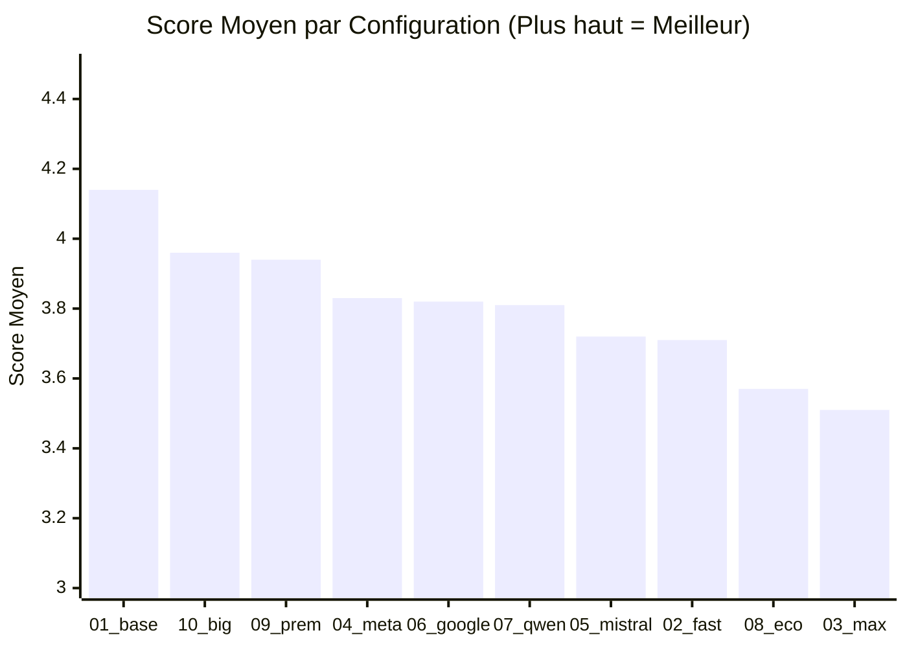
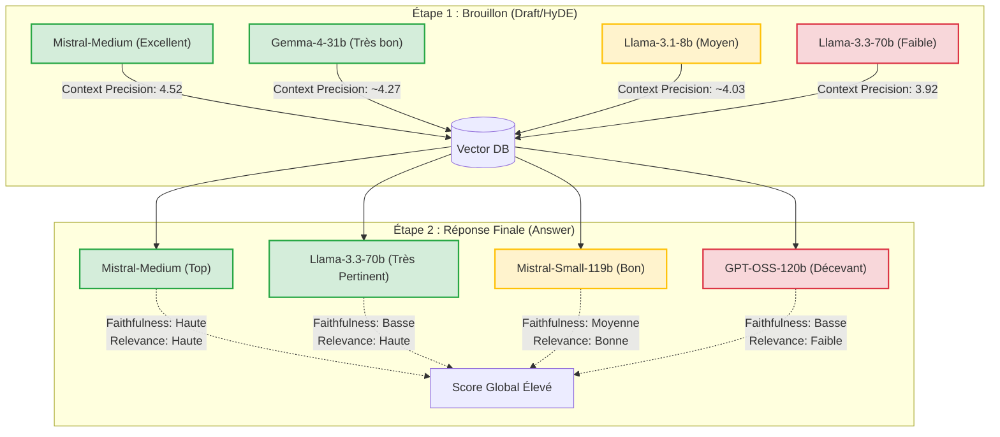

# Analyse des Performances du Benchmark RAGilaas

Voici un récapitulatif visuel et tabulaire des performances des différentes compositions de LLMs utilisées pour l'étape de brouillon (HyDE) et l'étape de réponse finale.

## Tableau Comparatif Global

Ce tableau classe les configurations par ordre décroissant de leur **Score Moyen** (la moyenne des 3 critères).

| Classement | Configuration | Modèle HyDE (Draft) | Modèle de Réponse (Answer) | Faithfulness | Answer Relevance | Context Precision | **Score Moyen** |
|:---:|---|---|---|:---:|:---:|:---:|:---:|
| 🥇 1 | **01_baseline** | mistral-medium-latest | mistral-medium-latest | 3.61 | **4.30** | **4.52** | **4.14** |
| 🥈 2 | **10_big_draft** | llama-3.3-70b | mistral-medium-latest | **3.67** | 4.29 | 3.92 | **3.96** |
| 🥉 3 | **09_premium_cross** | gemma-4-31b | mistral-small-4-119b | 3.54 | 4.04 | 4.25 | **3.94** |
| 4 | **04_meta_stack** | llama-3.1-8b | llama-3.3-70b | 3.14 | 4.29 | 4.07 | **3.83** |
| 5 | **06_google_mono** | gemma-4-31b | gemma-4-31b | 3.46 | 3.71 | 4.29 | **3.82** |
| 6 | **07_qwen_mono** | qwen-3.6-35b-instruct | qwen-3.6-35b-instruct | 3.38 | 3.79 | 4.25 | **3.81** |
| 7 | **05_mistral_stack** | mistral-small-3.2-24b | mistral-small-4-119b | 2.96 | 4.04 | 4.17 | **3.72** |
| 8 | **02_fast_draft** | llama-3.1-8b | mistral-medium-latest | 3.00 | 4.14 | 4.00 | **3.71** |
| 9 | **08_economy_cross** | llama-3.1-8b | qwen-3.6-35b-instruct | 2.96 | 3.70 | 4.04 | **3.57** |
| 10 | **03_max_quality** | mistral-small-4-119b | gpt-oss-120b | 3.00 | 3.54 | 4.00 | **3.51** |

---

## Graphique des Scores Moyens



> [!TIP]
> **Observation** : La baseline `01` domine largement grâce à un score de Context Precision très élevé (4.52), tandis que l'approche `10_big_draft` compense son plus faible Context Precision par d'excellentes qualités de rédaction (meilleure Faithfulness).

---

## Modèles de Draft vs Modèles de Réponse

Le schéma ci-dessous illustre l'impact des modèles sur les deux étapes clés du pipeline RAG : la création du document hypothétique (qui impacte la **Context Precision**) et la rédaction de la réponse (qui impacte la **Faithfulness** et l'**Answer Relevance**).



> [!IMPORTANT]  
> Le plus gros modèle pour la phase de HyDE (`llama-3.3-70b`) donne paradoxalement les moins bons résultats en recherche vectorielle. La simplicité de `mistral-medium-latest` ou de `gemma-4-31b` génère de bien meilleurs termes de recherche.

---

## Profil Radar des 3 Meilleures Configurations

Ce graphique illustre les forces et faiblesses des trois meilleures approches :

```mermaid
radarChart
  title Comparaison des Critères Clés
  axis Faithfulness, Context Precision, Answer Relevance
  
  "01_baseline (Mistral/Mistral)": 3.61, 4.52, 4.30
  "10_big_draft (Llama70b/Mistral)": 3.67, 3.92, 4.29
  "09_premium_cross (Gemma/Mistral119b)": 3.54, 4.25, 4.04
```
*(Aperçu conceptuel des différences d'équilibrage)*

> [!NOTE]  
> Si votre objectif est la **précision des informations** récupérées, optez pour l'approche **01_baseline**. Si vous privilégiez un **faible taux d'hallucination** quitte à perdre un peu en contexte, **10_big_draft** est la meilleure option.
