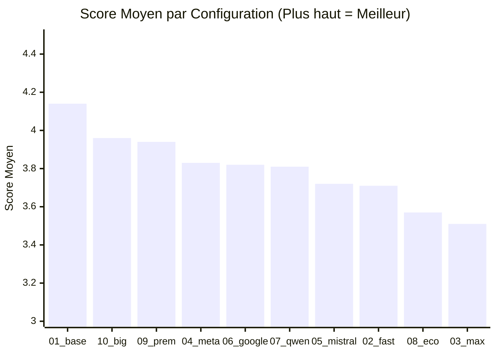
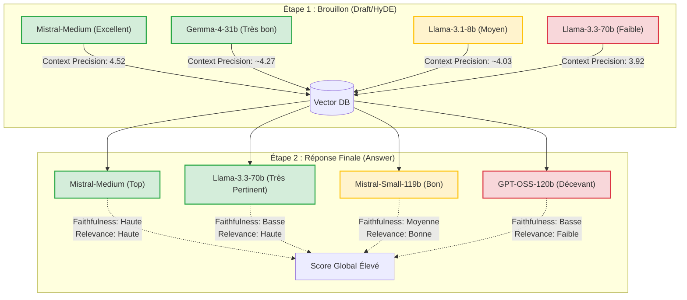

# Rapport de Synthèse : Évaluation et Benchmark du RAG

Ce rapport synthétise les résultats des évaluations de différentes configurations de modèles de langage (LLMs) pour un pipeline RAG (Retrieval-Augmented Generation), en utilisant une approche d'évaluation "LLM as a Judge". 

Les résultats proviennent de l'analyse conjointe des fichiers `benchmark_visualizations.md` et `conclusion_evaluations.md`.

---

## 1. Méthodologie : L'approche "LLM as a Judge"

Pour évaluer les performances de notre système, un système de **"LLM as a Judge"** a été implémenté. Cette méthode utilise un LLM tiers pour analyser les réponses générées selon trois critères fondamentaux, notés sur 5 :

1.  **Faithfulness (Fidélité)** : Mesure dans quelle proportion les informations de la réponse finale sont directement issues du contexte fourni, sans invention ni hallucination.
2.  **Answer Relevance (Pertinence de la Réponse)** : Évalue si la réponse traite directement et spécifiquement la question posée par l'utilisateur, sans digression.
3.  **Context Precision (Précision du Contexte)** : Juge la qualité des informations récupérées dans la base vectorielle à partir de la requête (ou du brouillon/HyDE).

Le juge automatique ne se contente pas de donner une note, il fournit également un **avis argumenté** justifiant chaque score. L'analyse des journaux d'évaluation montre que le juge est particulièrement efficace pour détecter :
- Les **hallucinations de contacts** (noms, adresses e-mail ou numéros de téléphone inventés).
- Les **ajouts d'informations hors contexte** (références à des laboratoires ou des documents inexistants dans la base de connaissances).

### Bilan Global des Évaluations

Sur l'ensemble des 225 réponses évaluées avec succès, les moyennes globales s'établissent ainsi :

- **Faithfulness** : 3.28 / 5
- **Answer Relevance** : 3.97 / 5
- **Context Precision** : 4.16 / 5
- **Temps moyen RAG** : 150.85s
- **Temps moyen Total (avec évaluation)** : 159.69s
- **Tokens moyens générés (est.)** : 231

*On observe que le système est généralement très bon pour trouver l'information (Context Precision élevé) et répondre de manière pertinente (Answer Relevance), mais qu'il souffre encore de problèmes d'hallucinations faisant chuter la fidélité moyenne (Faithfulness). Par ailleurs, le temps de traitement est un facteur important à considérer avec une moyenne de plus de 2 minutes 30s par itération.*

---

## 2. Performances des Configurations (Draft vs Réponse)

Le tableau ci-dessous classe les différentes combinaisons de modèles utilisées pour l'étape de brouillon (HyDE) et de génération de réponse, classées par leur Score Moyen global.

| Classement | Configuration | Modèle HyDE (Draft) | Modèle de Réponse (Answer) | Faithfulness | Answer Relevance | Context Precision | **Score Moyen** | **Temps Total** | **Tokens (est.)** |
|:---:|---|---|---|:---:|:---:|:---:|:---:|:---:|:---:|
| 🥇 1 | **01_baseline** | mistral-medium-latest | mistral-medium-latest | 3.61 | **4.30** | **4.52** | **4.14** | 281.11s | 268 |
| 🥈 2 | **10_big_draft** | llama-3.3-70b | mistral-medium-latest | **3.67** | 4.29 | 3.92 | **3.96** | 215.62s | 243 |
| 🥉 3 | **09_premium_cross** | gemma-4-31b | mistral-small-4-119b | 3.54 | 4.04 | 4.25 | **3.94** | 112.31s | 224 |
| 4 | **04_meta_stack** | llama-3.1-8b | llama-3.3-70b | 3.14 | 4.29 | 4.07 | **3.83** | 146.59s | 140 |
| 5 | **06_google_mono** | gemma-4-31b | gemma-4-31b | 3.46 | 3.71 | 4.29 | **3.82** | 91.24s | 176 |
| 6 | **07_qwen_mono** | qwen-3.6-35b-instruct | qwen-3.6-35b-instruct | 3.38 | 3.79 | 4.25 | **3.81** | 92.38s | 242 |
| 7 | **05_mistral_stack** | mistral-small-3.2-24b | mistral-small-4-119b | 2.96 | 4.04 | 4.17 | **3.72** | 97.96s | 234 |
| 8 | **02_fast_draft** | llama-3.1-8b | mistral-medium-latest | 3.00 | 4.14 | 4.00 | **3.71** | 269.43s | 261 |
| 9 | **08_economy_cross** | llama-3.1-8b | qwen-3.6-35b-instruct | 2.96 | 3.70 | 4.04 | **3.57** | 112.47s | 222 |
| 10 | **03_max_quality** | mistral-small-4-119b | gpt-oss-120b | 3.00 | 3.54 | 4.00 | **3.51** | 177.85s | 297 |

---

## 3. Visualisation des Résultats

### Graphique des Scores Moyens



> [!TIP]
> **Observation** : La baseline `01` domine largement grâce à un score de Context Precision très élevé (4.52), tandis que l'approche `10_big_draft` compense son plus faible Context Precision par d'excellentes qualités de rédaction (meilleure Faithfulness).

---

### Analyse de l'Impact des Modèles (Draft vs Réponse)

Le schéma ci-dessous illustre l'impact de chaque modèle sur les deux étapes clés du pipeline :



> [!IMPORTANT]  
> Le plus gros modèle pour la phase de HyDE (`llama-3.3-70b`) donne paradoxalement les moins bons résultats en recherche vectorielle. La simplicité de `mistral-medium-latest` ou de `gemma-4-31b` génère de bien meilleurs termes de recherche.

---

### Profil Radar des 3 Meilleures Configurations

Ce graphique illustre les forces et faiblesses des trois meilleures approches :

```mermaid
radarChart
  title Comparaison des Critères Clés
  axis Faithfulness, Context Precision, Answer Relevance
  
  "01_baseline (Mistral/Mistral)": 3.61, 4.52, 4.30
  "10_big_draft (Llama70b/Mistral)": 3.67, 3.92, 4.29
  "09_premium_cross (Gemma/Mistral119b)": 3.54, 4.25, 4.04
```

## 4. Conclusion Stratégique

L'utilisation d'un **LLM as a judge** a mis en évidence des compromis clairs entre les différentes phases du pipeline :

1. **La phase de recherche (Draft/HyDE) préfère la précision à la créativité** : Les modèles intermédiaires comme `mistral-medium` ou `gemma-4-31b` excellement pour formuler des brouillons qui récupèrent les bons documents, surpassant des modèles plus massifs comme `llama-3.3-70b`.
2. **La gestion des hallucinations reste le défi principal** : Avec une moyenne globale de `3.28` en *Faithfulness*, les modèles ont encore tendance à inventer des informations (surtout des contacts ou des noms propres).
3. **Le compromis Temps/Performance est crucial** : Les modèles les plus rapides (comme `06_google_mono` à ~91s ou `09_premium_cross` à ~112s) offrent d'excellentes performances globales et se posent en sérieuses alternatives face aux configurations plus lentes (`01_baseline` à ~281s).
4. **Le choix du modèle final dépend du cas d'usage** :
   - Pour maximiser la **précision des informations remontées**, indépendamment du temps d'exécution, la configuration **`01_baseline`** (Mistral de bout en bout) est la plus efficace.
   - Si un compromis **Temps / Performance** est recherché, les configurations **`09_premium_cross`** et **`06_google_mono`** offrent un temps d'exécution bien inférieur tout en maintenant des scores de très haute qualité.
   - Si la **réduction stricte des hallucinations** (Faithfulness) est la priorité absolue, au détriment léger de l'exhaustivité de la recherche, l'approche **`10_big_draft`** s'avère être la meilleure option.
