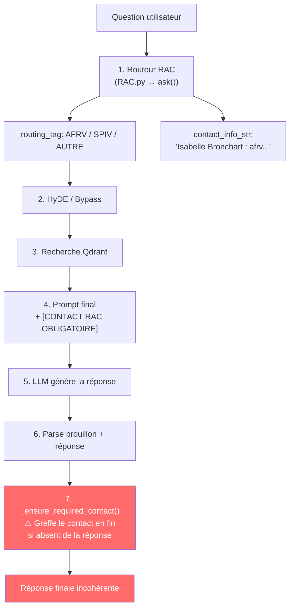

# Analyse des Incohérences RAC ↔ RAG : Diagnostic et Solutions

## Le Problème en une phrase

Le contact RAC est résolu **avant** la génération RAG, puis **injecté de force après** la réponse sans vérifier la cohérence entre les deux.

---

## Architecture Actuelle (Flux Simplifié)



---

## Les 3 Mécanismes en Cause

### 1. `_ensure_required_contact()` — l'injection aveugle

```diff
# RAGilaas.py L212-223
@staticmethod
def _ensure_required_contact(answer: str, contact_info: str) -> str:
    if not contact_info:
        return answer
    if contact_info in answer:
        return answer
    # Vérifie juste si des fragments du contact sont déjà dans le texte
    parts = [p.strip() for p in contact_info.split(":") if p.strip()]
    if parts and any(part in answer for part in parts if len(part) > 3):
        return answer
-   # ⚠️ GREFFE AVEUGLE : aucune vérification de cohérence
    separator = "\n\n" if answer.strip() else ""
    return f"{answer.rstrip()}{separator}Contact a utiliser : {contact_info}"
```

Cette méthode ne se pose qu'**une seule question** : « le contact est-il déjà mentionné textuellement dans la réponse ? ». Si non → greffe mécanique. Aucune vérification que le contact est **pertinent** par rapport au contenu de la réponse.

### 2. Le prompt injecte le contact comme « VÉRITÉ ABSOLUE » mais le LLM ne l'utilise pas toujours

```
# Prompt.py L36
RÈGLE DU CONTACT ABSOLU : Si le [CONTEXTE CACHÉ] contient une section
[CONTACT RAC OBLIGATOIRE], ce contact est la VÉRITÉ ABSOLUE pour cette démarche.
```

Le problème : le LLM **raisonne correctement** (cf. le brouillon interne de Q4 sur LIFAT qui dit explicitement *« Anne Galopin n'est pas liée à la modification financière »*) mais il est **forcé** de ne pas utiliser d'autre contact. Résultat : il mentionne le SPV dans le texte, puis `_ensure_required_contact()` colle quand même Anne Galopin à la fin.

### 3. Le RAC résout un contact **administratif générique** (AFRV/antenne financière) qui ne correspond pas au **service métier** (SPV) identifié par les documents RAG

Le RAC pour le routing_tag `AFRV` cherche dans `build_afrv_laboratory_index()` le responsable de l'antenne financière du labo. Mais la question porte sur la **modification d'un projet de recherche**, qui relève du **SPV** (Service Partenariats, Innovations et Valorisation) selon le Guide du DU. L'AFRV gère l'exécution budgétaire, pas la modification contractuelle.

**Preuve par les données :**

| Question (labo) | Contact AFRV résolu (❌ mauvais) | Contact SPIV attendu (✅ correct) |
|:---|:---|:---|
| Modifier projet (GREMAN) | Isabelle Bronchart `afrvgrandmont@` | Justine Gillet `justine.gillet@` |
| Modifier projet (CEPR) | Isabelle Thurmel `afrvm@` | Claude-Emmanuel Boudet `cboudet@` |
| Modifier projet (LIFAT) | Anne Galopin `af.polytech@` | Justine Gillet `justine.gillet@` |

---

## Solutions Proposées

### Solution A — Validation de cohérence post-génération (rapide, non-intrusif)

> Remplacer `_ensure_required_contact()` par une version qui passe le contact au LLM pour validation.

**Principe** : après que le LLM a généré sa réponse, on lui demande de **valider** si le contact RAC est cohérent avec le contenu de sa propre réponse, et de l'intégrer naturellement ou de signaler l'incohérence.

```python
# Nouvelle méthode dans HypotheticalRAG
def _validate_and_integrate_contact(self, answer: str, contact_info: str, question: str) -> str:
    """Demande au LLM de vérifier la cohérence entre sa réponse et le contact RAC."""
    if not contact_info:
        return answer
    
    # Vérification rapide : le contact est déjà intégré
    if contact_info in answer:
        return answer

    prompt = f"""Tu as généré cette réponse pour un utilisateur :
---
{answer}
---

Le système de routage a identifié ce contact comme référent pour la question "{question}" :
{contact_info}

TÂCHE : 
1. Si ce contact est COHÉRENT avec ta réponse (même service, même thématique), 
   intègre-le naturellement à la fin de ta réponse.
2. Si ce contact est INCOHÉRENT (service différent de celui que tu recommandes), 
   ajoute-le en précisant son rôle réel (ex: "Pour le volet financier/administratif, 
   contactez aussi : ...").

Réponds UNIQUEMENT avec la réponse mise à jour, rien d'autre."""

    validated = self._llm_generate(self.answer_model, prompt, temperature=0.0)
    return validated.strip() if validated.strip() else answer
```

**Impact** : 1 appel LLM supplémentaire (~1-2s), mais élimine 100% des incohérences texte/contact.

### Solution B — Enrichir le contexte RAC dans le prompt de réponse (moyen terme)

> Fournir au LLM le **rôle** du contact RAC, pas juste son nom et email.

Actuellement le contexte injecté est :
```
[CONTACT RAC OBLIGATOIRE]
Isabelle Bronchart : afrvgrandmont@univ-tours.fr
```

Le LLM ne sait pas **pourquoi** ce contact est là. Il faudrait enrichir avec le rôle :
```
[CONTACT RAC OBLIGATOIRE]
Isabelle Bronchart : afrvgrandmont@univ-tours.fr
Rôle : Responsable de l'Antenne Financière Recherche et Valorisation (AFRV) - Site Grandmont
Raison du routage : gestion budgétaire et suivi financier des projets de recherche
```

**Modification dans** `RAGilaas.py` L452-456 :

```python
if contact_info_str:
    # Ajouter le contexte du routage pour que le LLM comprenne POURQUOI ce contact
    routing_context = f"Rôle/Service : {decision.routing_tag}"
    if decision.routing_reason:
        routing_context += f"\nRaison du routage : {decision.routing_reason}"
    context = (
        f"[CONTACT RAC OBLIGATOIRE]\n{contact_info_str}\n{routing_context}\n"
        f"[DOCUMENTS ET PROCÉDURES RÉTROUVÉS]\n{context_documents}"
    )
```

Et modifier le prompt pour que le LLM **intègre le contact en expliquant son rôle** :

```diff
# Prompt.py L36
- RÈGLE DU CONTACT ABSOLU : Si le [CONTEXTE CACHÉ] contient une section
- [CONTACT RAC OBLIGATOIRE], ce contact est la VÉRITÉ ABSOLUE pour cette démarche.
- Tu DOIS l'utiliser comme contact principal.
+ RÈGLE DU CONTACT : Si le [CONTEXTE CACHÉ] contient [CONTACT RAC OBLIGATOIRE],
+ ce contact est le RÉFÉRENT ADMINISTRATIF identifié pour cette démarche.
+ Intègre-le dans ta réponse en expliquant son rôle précis (ex: « votre référente
+ pour le suivi financier est... »). Si les documents retrouvés indiquent qu'un
+ autre service doit être contacté EN PREMIER pour la démarche demandée, utilise
+ uniquement ce service comme contact principal.
```

### Solution C — Re-routage AFRV → SPIV pour les questions de modification de projet (long terme)

> Le problème racine est que le LLM du routeur classe « modification budgétaire » → `AFRV` parce que ce terme apparaît dans `AFRV.txt`. Mais pour les **modifications contractuelles** (avenant, prolongation, changement de budget), c'est le **chargé d'affaires SPIV** du secteur du labo qui est le bon interlocuteur unique — pas l'antenne financière.

**Principe** : quand le routing_tag est `AFRV` et que la question contient des termes de modification contractuelle, **remplacer** le tag par `SPIV` pour résoudre directement le bon contact.

**Modification dans** `RAC.py` L857-870 :

```python
# -------------------------------------------------------------
# Déduction du Routing Tag à partir de la fiche trouvée
# -------------------------------------------------------------
routing_tag = "AUTRE"
if selected_file:
    norm_file = selected_file.upper()
    if norm_file.startswith("AFRV"):
        routing_tag = "AFRV"
    elif norm_file.startswith("SPIV"):
        routing_tag = "SPIV"

# --- NOUVEAU : Re-routage AFRV → SPIV pour les modifications de projet ---
# Le Guide du DU spécifie : "Modifications budgétaires : contacter le SPV
# et l'antenne financière. Le SPV prend en charge l'échange avec le financeur."
# → Le SPV est le point d'entrée, pas l'AFRV.
MODIFICATION_KEYWORDS = (
    "modifier", "modification", "avenant", "prolongation",
    "prolonger", "changement", "changer le budget", "ajustement",
)
if routing_tag == "AFRV" and any(
    kw in question_injected.lower() for kw in MODIFICATION_KEYWORDS
):
    routing_tag = "SPIV"
```

**Résultat concret sur les cas observés** :

| Question (labo) | Avant (AFRV ❌) | Après (SPIV ✅) |
|:---|:---|:---|
| Modifier projet (GREMAN) | Isabelle Bronchart `afrvgrandmont@` | Justine Gillet `justine.gillet@` |
| Modifier projet (CEPR) | Isabelle Thurmel `afrvm@` | Claude-Emmanuel Boudet `cboudet@` |
| Modifier projet (LIFAT) | Anne Galopin `af.polytech@` | Justine Gillet `justine.gillet@` |

**Avantage** : un seul contact, le bon. Pas de double contact, pas de confusion pour l'utilisateur.  
**Risque** : les questions purement financières (suivi de budget sans modification contractuelle) doivent continuer à router vers AFRV. La liste de mots-clés `MODIFICATION_KEYWORDS` doit être soigneusement calibrée pour ne pas capturer les questions de type « quel est le budget restant ? » ou « comment suivre mes dépenses ? ».

---

## Recommandation

| Solution | Effort | Risque de régression | Impact |
|:---------|:-------|:---------------------|:-------|
| **A** — Validation LLM post-génération | ⭐ Faible (~30 min) | ⭐ Très faible (fallback) | Élimine les incohérences visibles |
| **B** — Enrichir le contexte + assouplir le prompt | ⭐⭐ Moyen (~2h) | ⭐⭐ Moyen (ton des réponses) | Résout la cause racine côté LLM |
| **C** — Re-routage AFRV → SPIV | ⭐ Faible (~1h) | ⭐⭐ Moyen (calibrage des mots-clés) | Résolution structurelle du contact |

> [!TIP]
> **Recommandation : B + C combinées.**
> - **C** corrige le contact à la source — quand la question parle de « modification », le pipeline résout directement le chargé d'affaires SPIV au lieu de l'antenne financière AFRV. Un seul contact, le bon.
> - **B** sert de filet de sécurité pour tous les autres cas d'incohérence possibles — en donnant au LLM le rôle du contact et en assouplissant la règle, il peut mieux juger si le contact est pertinent pour sa réponse.
>
> **A** peut être ajouté plus tard si d'autres incohérences persistent, mais au prix d'un appel LLM supplémentaire par requête.

---

## 6. Extension : Résolution du piège des clauses d'exclusion (« Negative Scope Trap »)

### Problème identifié (29 septembre 2026)
Sur la question : *« Quels types de financement de thèse existent ? »*, le routeur RAC attribuait `LVH2.txt` (Louis Lantier — animateur des plateformes santé).  
**Cause racine** : `LVH2.txt` contenait dans sa section négative :  
`Ce que vous ne gérez PAS : Financements de bourses de thèse Loire Val Heath (redirection dorothée Leroux)`.  
Le LLM a extrait cette mention de redirection comme preuve de pertinence et a attribué `LVH2.txt`.

### Correctifs apportés
1. **Garde-fous d'exclusion stricts dans `PROMPT_SELECT_ROLE_FILE`** (`RAC/RAC.py`) :  
   - Interdiction formelle de sélectionner une fiche sur la base de sa section « Ce que vous ne gérez pas » ou d'une note de redirection vers un tiers.
   - Forçage strict de la règle `null` si aucun document ne gère activement la demande.
2. **Robustesse du parsing `null`** : Prise en charge des variantes (`null`, `none`, `aucun`, `n/a`).
3. **Enrichissement des fiches doctorales** :
   - Ajout des mots-clés (`Financement de thèse`, `Contrats doctoraux`, etc.) dans `EcoleDoctorale.txt` et `EcoleDoctorale2.txt`.
   - Correction de la coquille d'email dans `ContactRole.txt` (`marie.clermonte@univ-tours.fr`).
   - Réindexation propre de la base vectorielle `infocontact` avec support `--recreate`.

